## 
LAPORAN PRAKTIKUM JOBSHEET 1

## 
Setup Project Next.js menggunakan Pages Router

  

  

  

## 
Oleh :

## 
Nova Eliza Maharani

## 
NIM. 2341720252 

  

## 
PROGRAM STUDI D-IV TEKNIK INFORMATIKA

## 
JURUSAN TEKNOLOGI INFORMASI

## 
POLITEKNIK NEGERI MALANG

## 
FEBRUARI 2026

  

## Hasil Praktikum

### Langkah 1 – Pengecekan Lingkungan

#### node -v dan npm -v
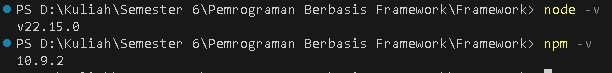
#### git -v
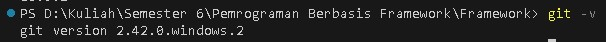

### Langkah 2 – Membuat Project Next.js

#### Membuat direktori baru dan masuk ke direktori kerja
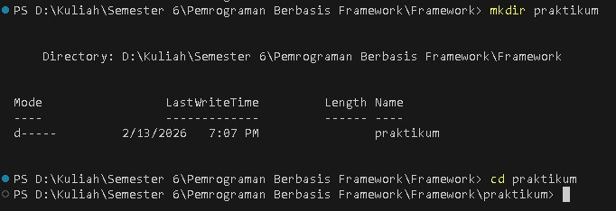
#### Menjalankan perintah

### Langkah 3 – Menjalankan Server Development

#### Masuk ke folder project
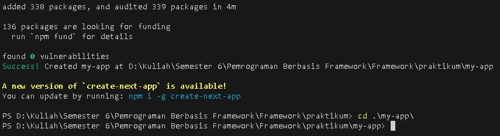
#### Menjalankan aplikasi dengan npm run dev
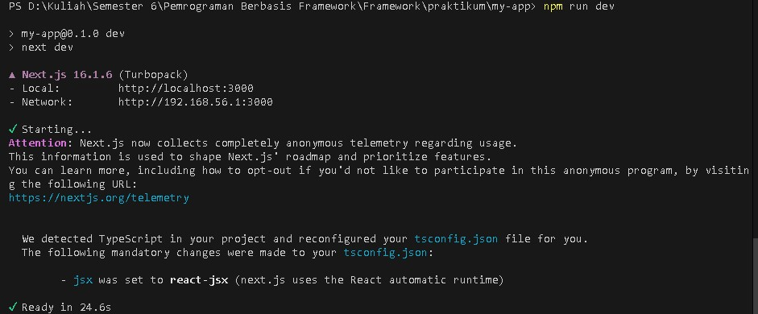
#### Buka browser dan akses: http://localhost:3000
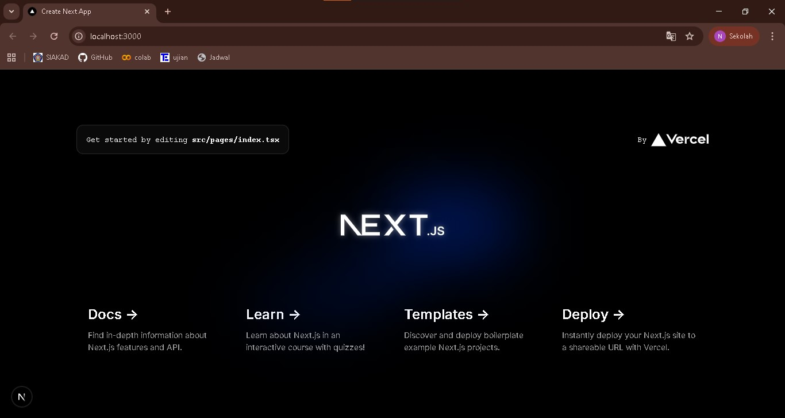

### Langkah 4 – Mengenal Struktur Folder

#### pages/ → tempat routing halaman
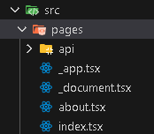
#### public/ → aset statis
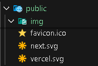
#### styles/ → file CSS
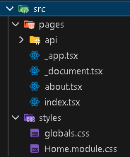
#### package.json → konfigurasi project
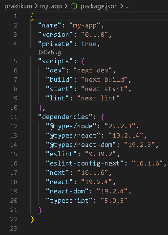
#### gitIgnore -> file konfigurasi di Git
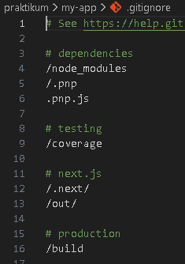

### Langkah 5 – Modifikasi Halaman Utama
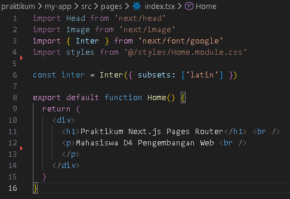
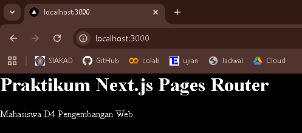

### Langkah 6 – Modifikasi API
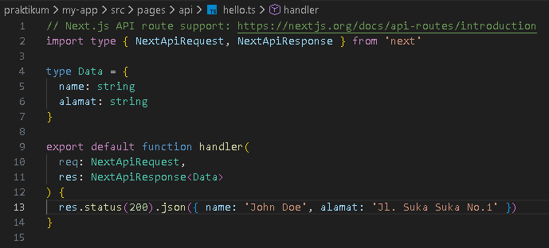
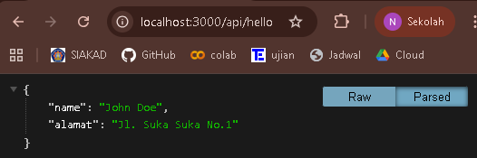

### Langkah 7 – Modifikasi Background
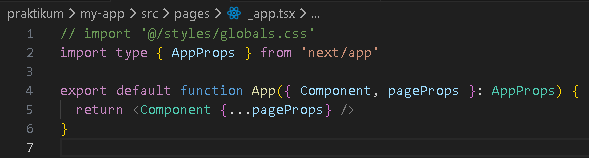
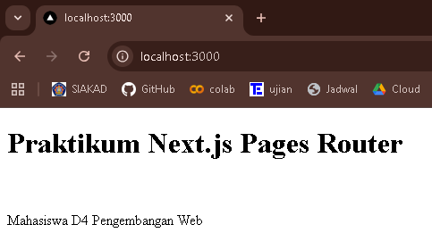

## Tugas Praktikum
### Tugas 1
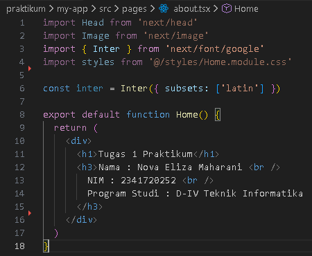
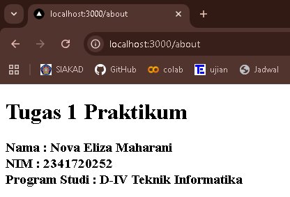
## Tugas 2
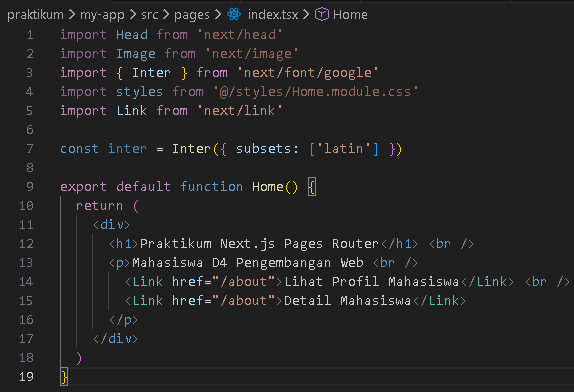
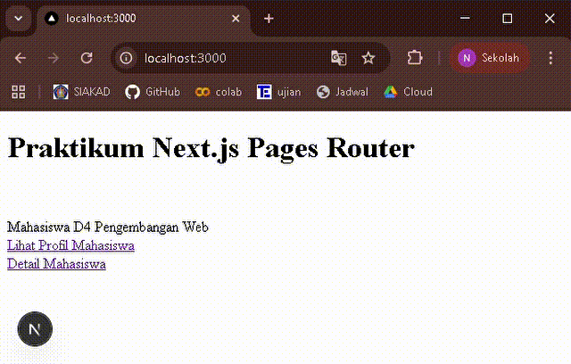

## Pertanyaan Refleksi

### 1. Mengapa Pages Router disebut sebagai routing berbasis file?
Karena kita tidak perlu mendefinisikan rute secara manual dan tiap file yang ada pada folder pages/ akan otomatis menjadi rute web. Contohnya 
- pages/index.tsx menjadi (/)
- pages/about.tsx menjadi /about

### 2.  Apa perbedaan Next.js dengan React standar (CRA)?
Next.js berbeda dengan Reaxt Standar karena Next.js menyediakan routing otomatis berbasis file di folder pages/, mendukung CSR, SSR, dan SSG, serta memiliki fitur built-in seperti API routes dan optimasi gambar, sementara CRA hanya mendukung client-side rendering dan memerlukan library tambahan untuk routing dan optimasi, serta membutuhkan konfigurasi ekstra saat deployment

### 3. Apa fungsi perintah npm run dev?
Untuk memulai server pengembangan yang secara otomatis memuat ulang apabila terdapat perubahan

### 4. Apa perbedaan npm run dev dan run build?
- npm run dev : untuk menjalankan server pengembangan atau melalukan debugging, digunakan ketika sedang coding di komputer
- bpm run build : untuk membangun aplikasi Next.js yang siap diproduksi atau deploy, digunakan saat aplikasi sudah selesai dan siap diunggah ke server