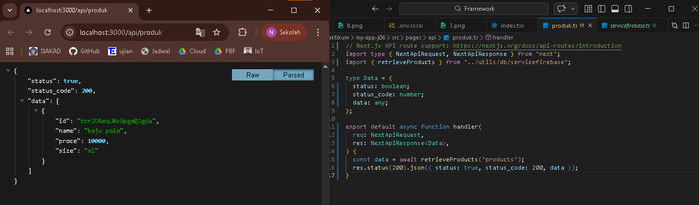
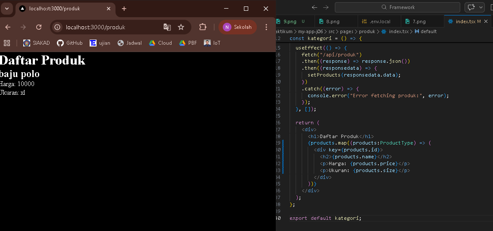
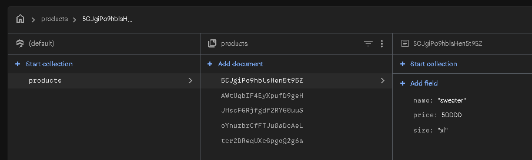
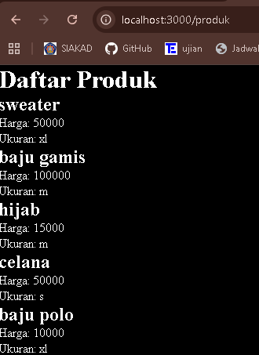
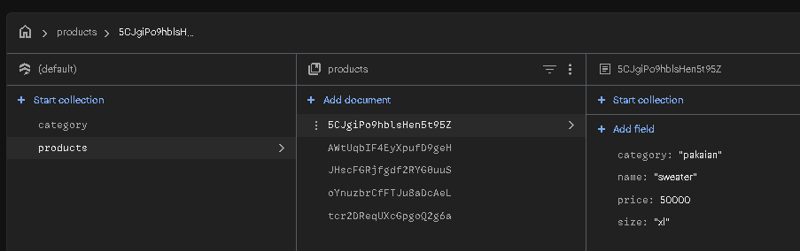
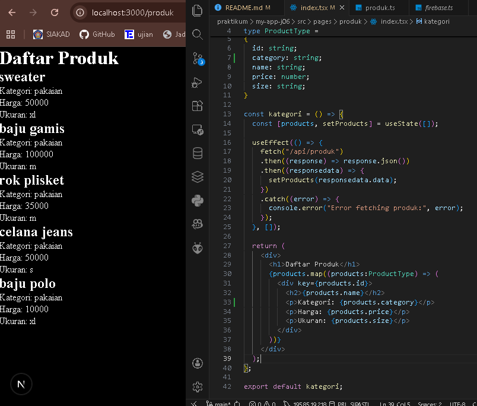
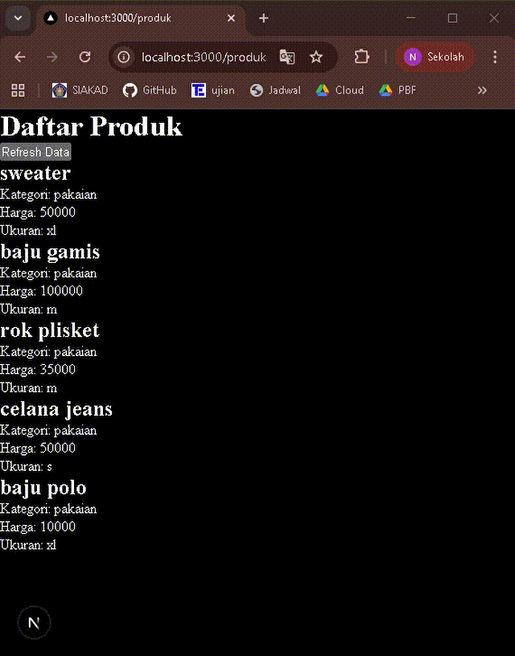

## 
LAPORAN PRAKTIKUM JOBSHEET 6

## 
API ROUTES

  

  

  

## 
Oleh :

## 
Nova Eliza Maharani

## 
NIM. 2341720252 

  

## 
PROGRAM STUDI D-IV TEKNIK INFORMATIKA

## 
JURUSAN TEKNOLOGI INFORMASI

## 
POLITEKNIK NEGERI MALANG

## 
FEBRUARI 2026

  

## Hasil Praktikum

### Langkah 1 – Menjalankan Project

### Langkah 2 – Membuat API Produk

### Langkah 3 – Fetch Data API di Frontend

## Integrasi Firebase

### Langkah 5 - Setup Firebase

Hasil set up Firebase

### Langkah 6 – Install Firebase

### Langkah 7 – Konfigurasi Environment Variable

### Langkah 8 – Konfigurasi Firebase

### Langkah 9 – Ambil Data dari Firestore

### Langkah 10 – API Mengambil Data Firebase

## Tugas Praktikum

### Tugas 1

### Tugas 2

### Tugas 3

## Pertanyaan Evaluasi

### 1. Apa fungsi API Routes pada Next.js?
Jawab : Api routes berfungsi sebagai
1. Mengambil data dari database
2. Mengelola autentikasi
3. Menyimpan atau menghapus data
4. Membuat endpoint seperti ``/api/product``

### 2. Mengapa .env.local tidak boleh di-push ke repository?
Jawab : Karena file ``.env.local`` berisi seperti API key dan secret token, apabila di push maka akan beresiko data bocor, aplikasi bisaa diretas dan database bisa diakses orang lain

### 3. Apa perbedaan data statis dan data dinamis?
Jawab : 
- Data Statis
1. Data tetap
2. Tidak berubah-ubah
3. Biasanya sudah ditentukan saat build
contoh : halaman profil
- Data Dinamis
1. Data bisa berubah
2. Biasanya diambil dari database atau API
contoh : daftar produk

### 4. Mengapa Next.js disebut framework fullstack?
Jawab : Karena dapat menangani frontend dan backend dalam satu project. Next.js dapat digunakan untuk membuat tampilan (React UI), menyediakan API backend, serta mendukung SSR dan SSG. Jadi,  kita bisa membuat website lengkap beserta logika server dan koneksi database tanpa perlu framework terpisah seperti Laravel.