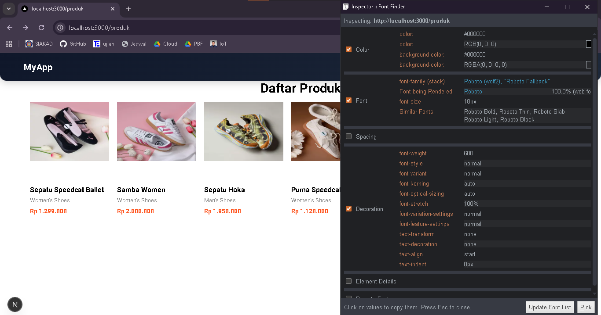
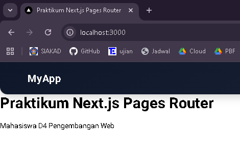
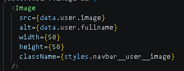
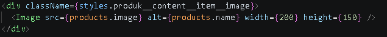
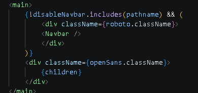
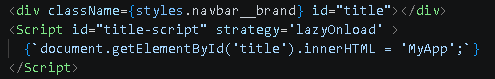
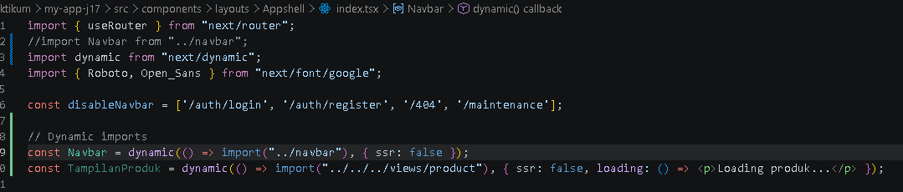
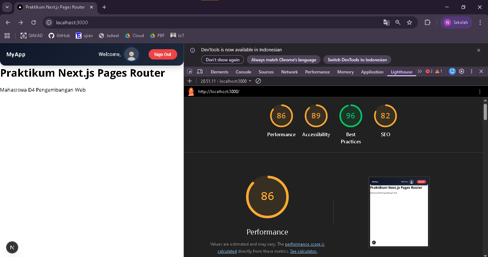

## 
LAPORAN PRAKTIKUM JOBSHEET 16

## 
OPTIMIZE

  

  

  

## 
Oleh :

## 
Nova Eliza Maharani

## 
NIM. 2341720252 

  

## 
PROGRAM STUDI D-IV TEKNIK INFORMATIKA

## 
JURUSAN TEKNOLOGI INFORMASI

## 
POLITEKNIK NEGERI MALANG

## 
APRIL 2026

  

## Praktikum 1 – Image Optimizatio

### Langkah 1 – Optimasi Gambar Lokal (Public Folder) 

### Langkah 2 - Optimasi Gambar Remote (External URL) 

## Praktikum 2 – Font Optimization

## Langkah 1 - Menggunakan next/font 

## Praktikum 3 - Script Optimization

## Langkah 1 - Menggunakan next/script
Ketika halaman di refresh, tulisan myapp akan berkedip

## Langkah 2 - Strategi Script
| Strategy | Fungsi |
| :--- | :--- |
| **beforeInteractive** | Dimuat sebelum halaman menjadi interaktif (cocok untuk skrip kritis). |
| **afterInteractive** | Dimuat segera setelah halaman menjadi interaktif (default). |
| **lazyOnload** | Dimuat saat waktu luang (idle), setelah semua sumber daya selesai dimuat. |
| **worker** | Dimuat di dalam Web Worker untuk mengurangi beban pada main thread. |

## Praktikum 4 – Optimasi Avatar dengan next/image 

## Tugas Praktikum

1. Optimasi semua image di project menggunakan next/image

2. Gunakan minimal 1 font dari next/font

3. Tambahkan script Google Analytics menggunakan next/

4. Terapkan dynamic import pada minimal 1 komponen

5. Dokumentasikan perubahan performa (screenshot Lighthouse)

## Refleksi dan Diskusi

1. Mengapa  biasa tidak optimal?
Jawab :  tidak optimal karena tidak memiliki fitur optimasi seperti kompresi, resize, dan lazy loading sehingga dapat memperlambat loading halaman.

2. Apa perbedaan font CDN dan next/font?
Jawab : Font CDN diambil dari server eksternal sehingga membutuhkan request tambahan, sedangkan next/font di-host langsung oleh Next.js sehingga lebih cepat dan stabil.

3. Mengapa script bisa membuat website lambat?
Jawab : Script dapat membuat website lambat karena dijalankan di main thread dan bisa memblokir proses rendering halaman.

4. Kapan harus menggunakan dynamic import?
Jawab : Dynamic import digunakan saat komponen besar, tidak langsung dibutuhkan, atau hanya berjalan di client untuk mengurangi beban awal.

5. Apa dampak bundle size terhadap UX?
Jawab : Bundle size yang besar membuat waktu loading lebih lama sehingga UX menjadi lambat dan kurang responsif.

