## 
LAPORAN PRAKTIKUM JOBSHEET 18

## 
UNIT TESTING

  

  

  

## 
Oleh :

## 
Nova Eliza Maharani

## 
NIM. 2341720252 

  

## 
PROGRAM STUDI D-IV TEKNIK INFORMATIKA

## 
JURUSAN TEKNOLOGI INFORMASI

## 
POLITEKNIK NEGERI MALANG

## 
APRIL 2026

  

## Praktikum 1 – Setup Jest di Next.js

### Langkah 1 – Install Dependencies

### Langkah 2 - Buat File Konfigurasi

### Langkah 3 - Tambahkan script di package.json

## Praktikum 2 – Struktur Folder Testing

## Praktikum 3 – Testing Halaman About

### Langkah 1 - Buat File Testing

### Langkah 2 - Contoh Testing Snapshot. Pada about.spec.tsx tambahkan code berikut :

### Langkah 3 - Jalankan Testing

## Praktikum 4 - Coverage Report

- Menjalankan ``npm run test:coverage``

- Folder /coverage

- Hasil

## Praktikum 5 - Konfigurasi Coverage Lengkap

- update ``jest.config.mjs``

- Menjalankan ``npm run test:coverage``

- Hasil dari ``index.html``

## Praktikum 6 - Testing dengan getByTestId

- Hasil menambahkan About Page
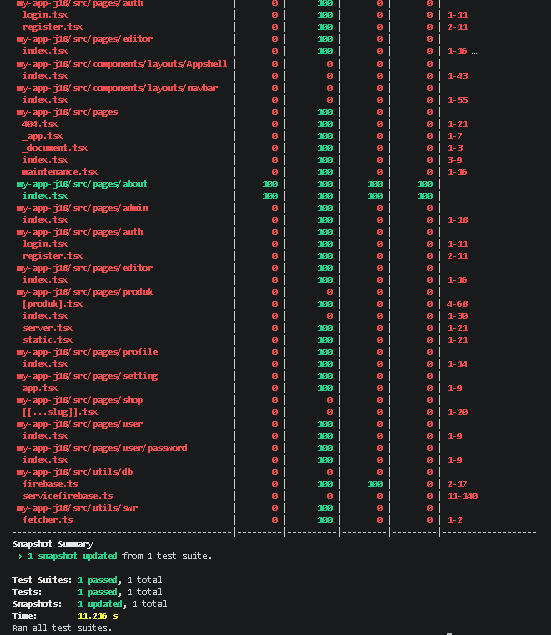

- Hasil menambahkan About (dibuat salah)
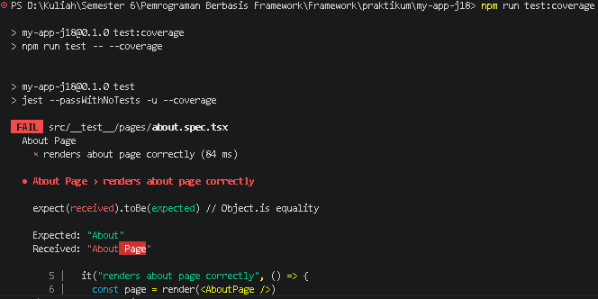

## Praktikum 7 – Testing Page dengan Router (Mocking)

- Hasil testing halaman produk
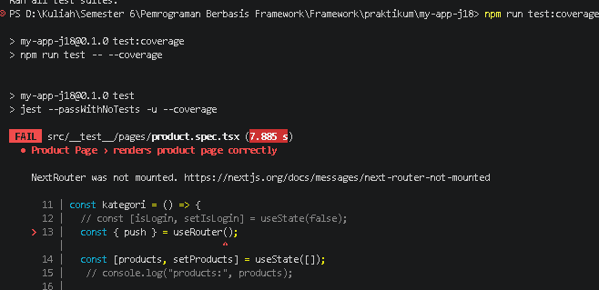

## Praktikum 8 - Menangani Indefined Data

- Hasil menjalankan npm run test:coverage akan error
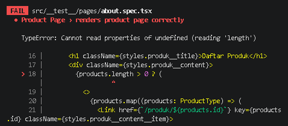

## Analisis Coverage

Jika dilihat aplikasi yang dibuat masih 5% jadi perlu banyak perbaikan sebelum proses deploy.
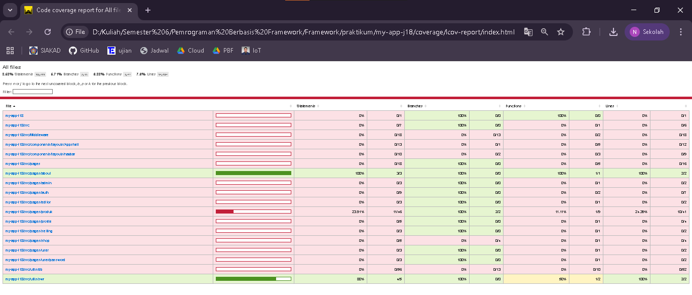

## Tugas Praktikum

1. Buat unit test untuk:
o Halaman Product
o 1 Komponen
- Hasil unit test halaman produk dan about
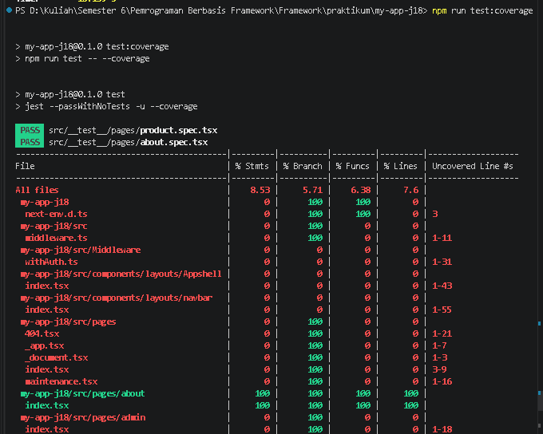
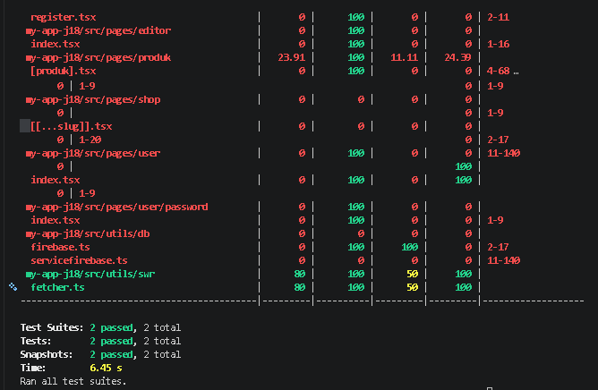

2. Gunakan minimal:
o 1 Snapshot test
o 1 toBe()
o 1 getByTestId()
- Hasil menggunakannya pada halaman produk dan about
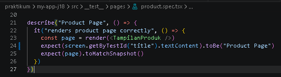
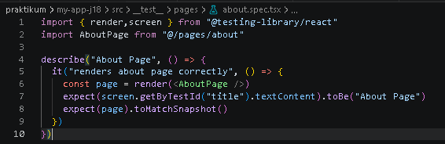

3. Buat coverage minimal 50%
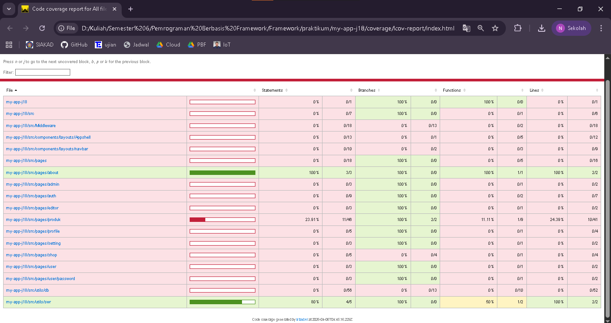

4. Lakukan mocking untuk router
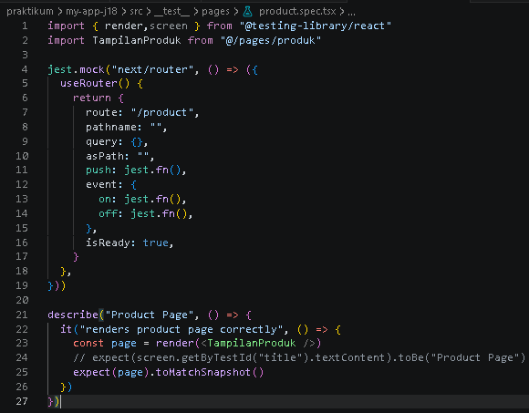

5. Dokumentasikan hasil coverage

## Diskusi dan Refleksi

1. Mengapa unit testing penting sebelum production?
Jawab : Unit testing penting sebelum production karena memastikan setiap bagian kode bekerja sesuai harapan dan mengurangi risiko bug.

2. Mengapa branch coverage sulit mencapai 100%?
Jawab : Branch coverage sulit mencapai 100% karena beberapa kondisi atau error handling sulit direplikasi dalam test.

3. Apa itu mocking?
Jawab : Mocking adalah membuat versi tiruan dari fungsi atau modul agar test bisa dijalankan tanpa tergantung lingkungan asli.

4. Kapan snapshot test digunakan?
Jawab : Snapshot test digunakan untuk memeriksa apakah tampilan UI tetap konsisten setelah perubahan kode.

5. Apakah semua file harus dites?
Jawab : Tidak semua file harus dites, hanya fokus pada kode yang kritikal, kompleks, atau berisiko menimbulkan error.