## 
LAPORAN PRAKTIKUM JOBSHEET 19

## 
DEPLOY VERCEL

  

  

  

## 
Oleh :

## 
Nova Eliza Maharani

## 
NIM. 2341720252 

  

## 
PROGRAM STUDI D-IV TEKNIK INFORMATIKA

## 
JURUSAN TEKNOLOGI INFORMASI

## 
POLITEKNIK NEGERI MALANG

## 
APRIL 2026

  

## Praktikum 1 – Membuat Repository GitHub
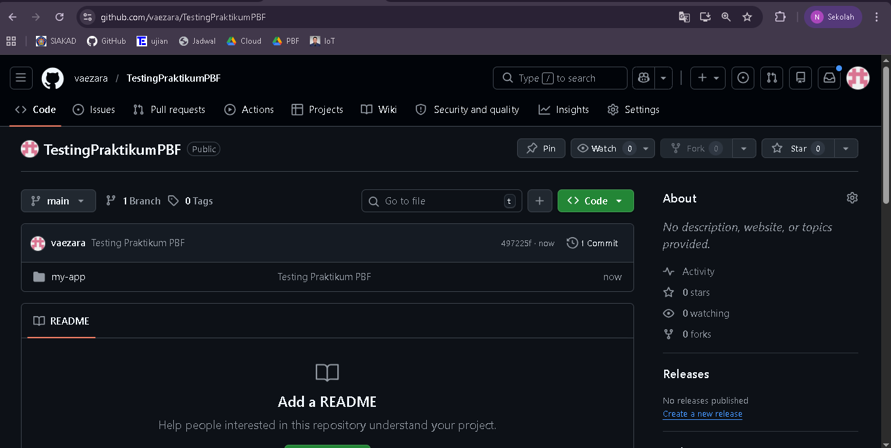

## Praktikum 2 – Deployment ke Vercel
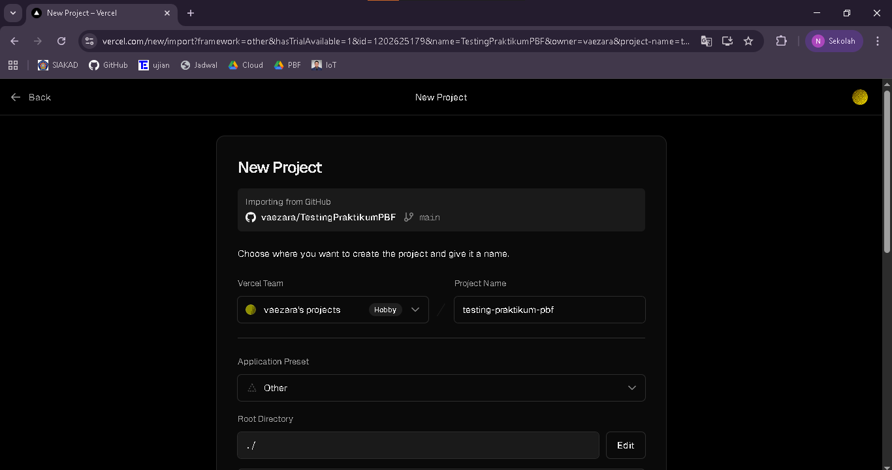

Hasil 
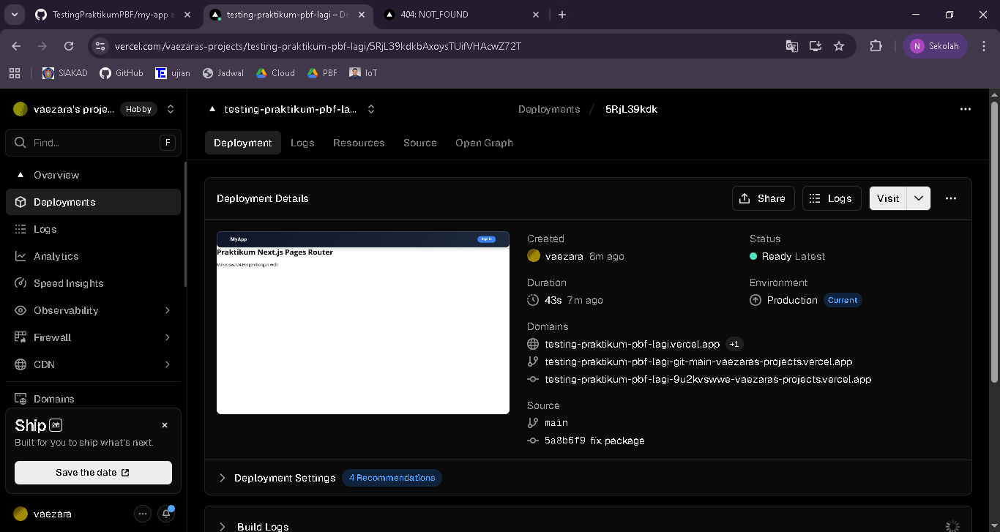

## Praktikum 3 – Menambahkan Environment Variable di Verce
Hasil setelah redeploy
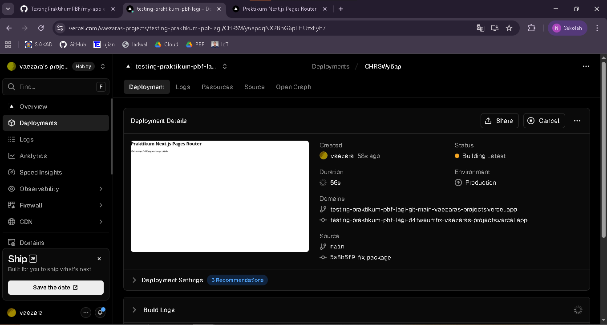

## Praktikum 4 – Konfigurasi Google OAuth Productio
Setting Authorized origins dan URL
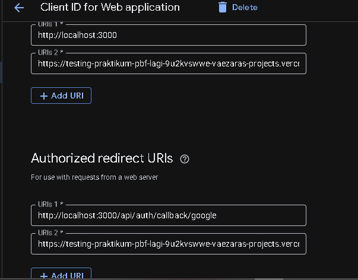

Hasil redeploy
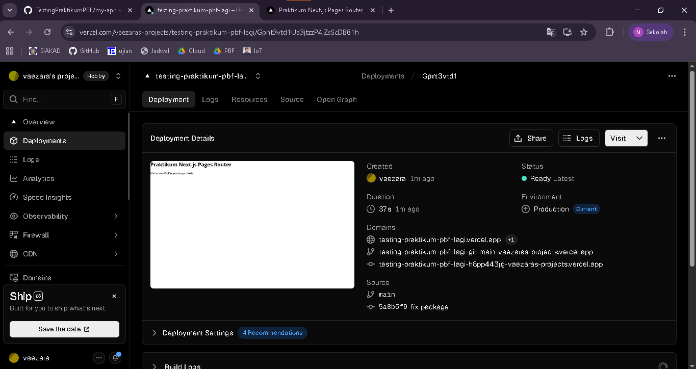

## Praktikum 5 - Pengujian Setelah Deployment

• /
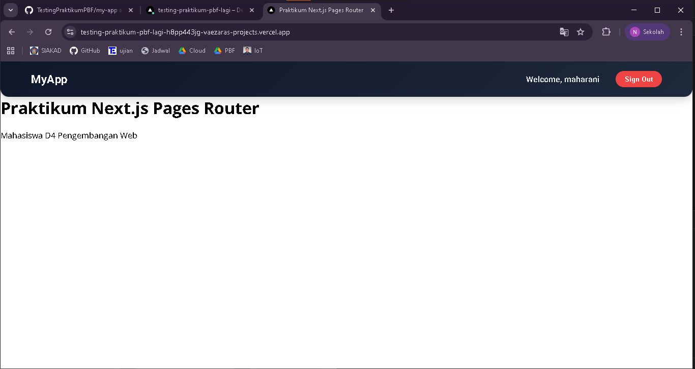

• /about
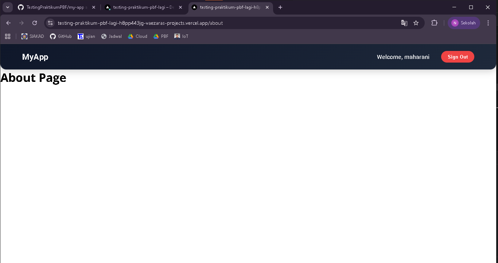

• /product
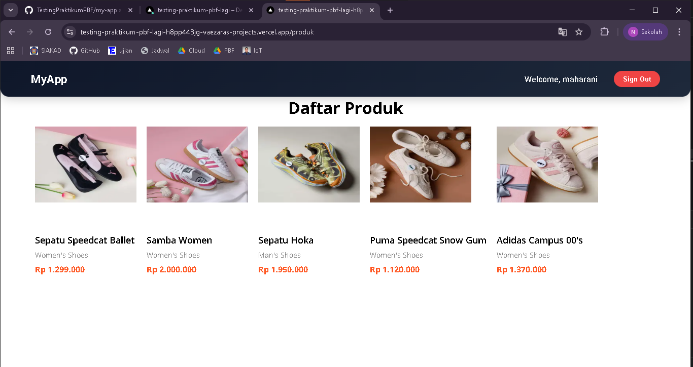

• /profile
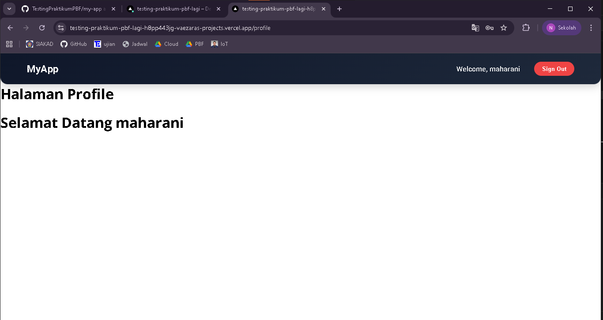

• Login Google
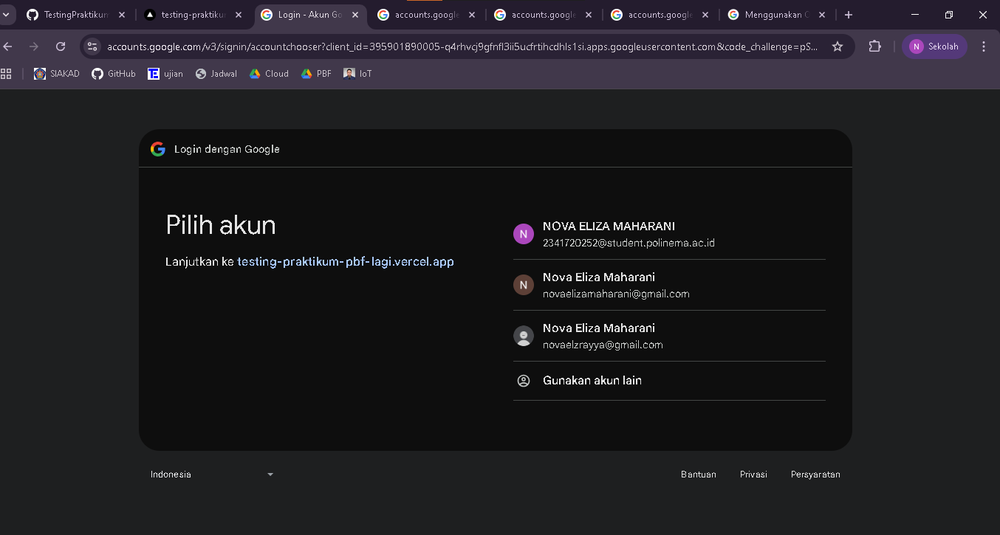
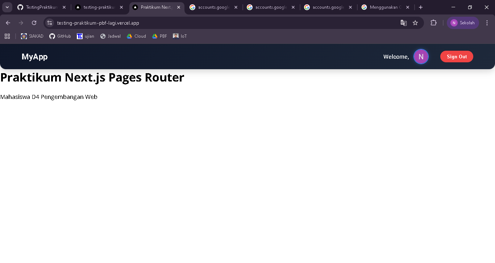

• Login credential biasa
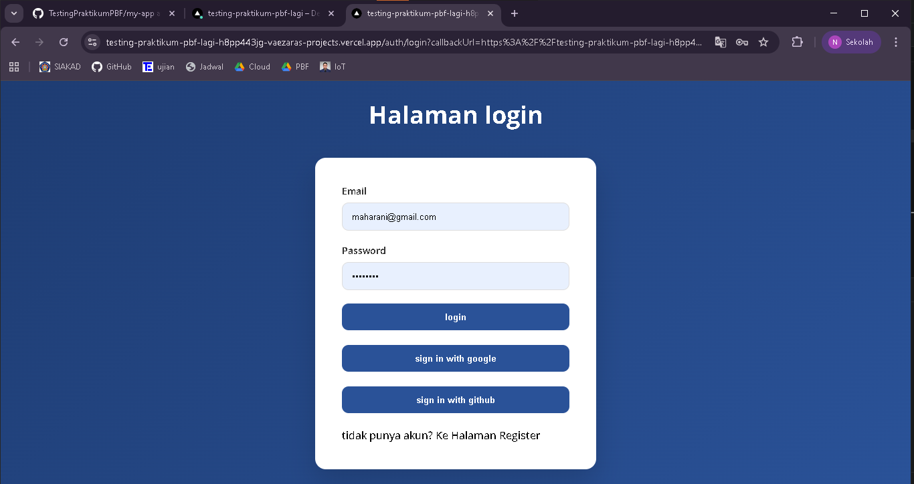

## Tugas Praktikum
1. Deploy project Next.js ke 

2. Pastikan API tidak menggunakan localhost

3. Konfigurasikan Google OAuth production

4. Lakukan minimal 1 redeploy

5. Dokumentasikan:

o Screenshot dashboard Vercel

o URL hasil deployment
``https://testing-praktikum-pbf-lagi.vercel.app/``

o Screenshot login Google berhasil

## Refleksi dan Diskusi

1. Mengapa localhost tidak boleh digunakan di production?
Jawab : Karena localhost hanya bisa diakses secara lokal, tidak bisa diakses publik. production harus pakai domain/public IP.

2. Mengapa SSG bisa gagal saat build?
Jawab : Karena SSG membutuhkan data saat build, jika API/data tidak tersedia (misal localhost), build akan gagal.

3. Apa perbedaan SSR dan SSG saat deployment?
- SSR: halaman dibangun saat request → selalu up-to-date.
- SSG: halaman dibangun saat build → cepat tapi statis.

4. Mengapa perlu redeploy setelah menambahkan environment?
Jawab : Karena perubahan environment variabel baru akan diterapkan hanya saat build/deploy.

5. Apa fungsi redirect URI pada OAuth?
Jawab : Untuk menentukan alamat tujuan setelah login berhasil agar token dikirim ke aplikasi yang benar.