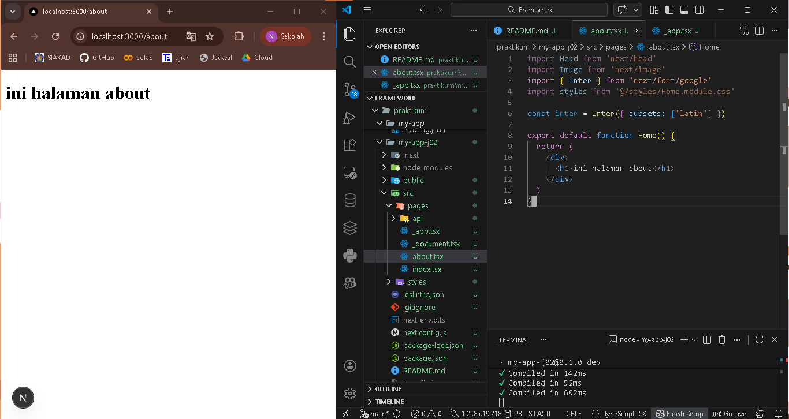
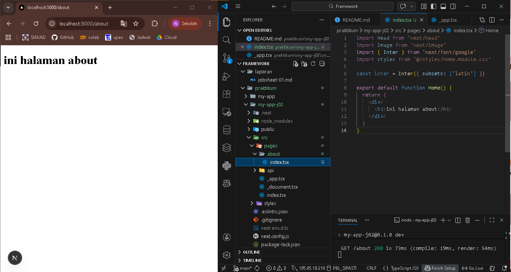
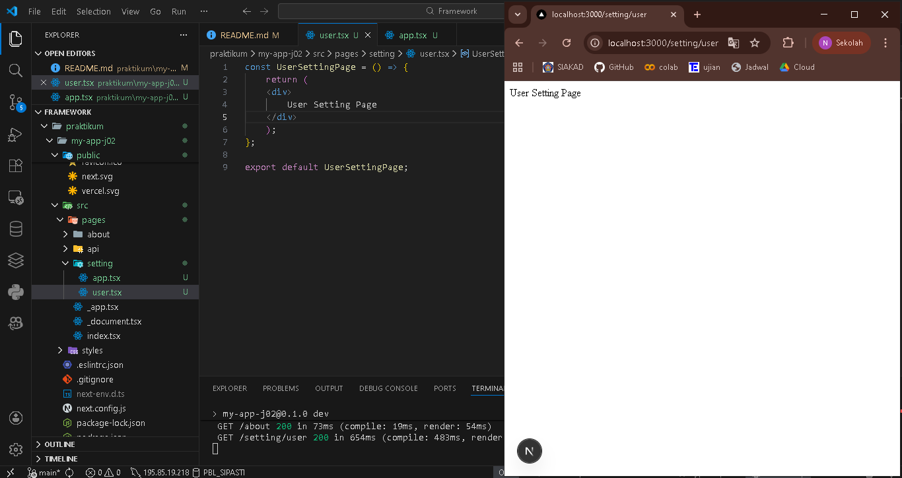
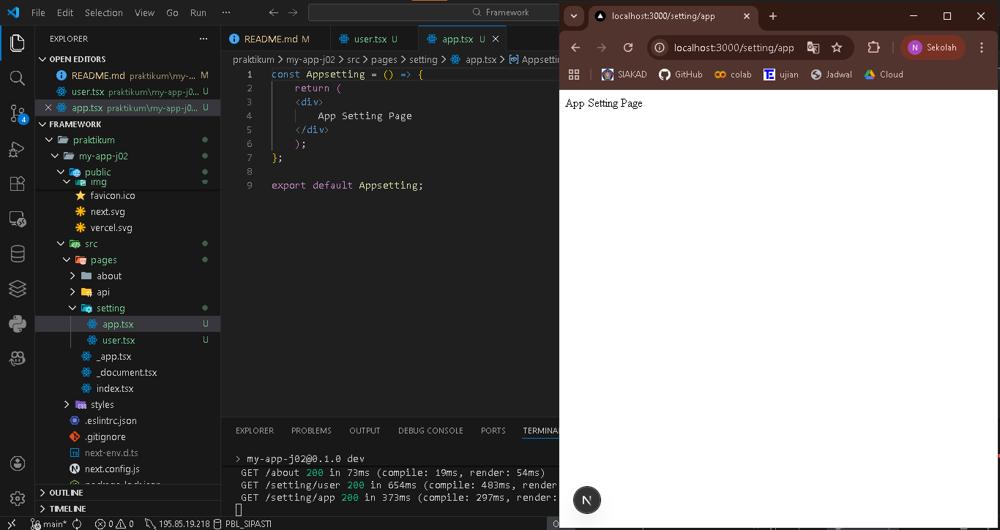
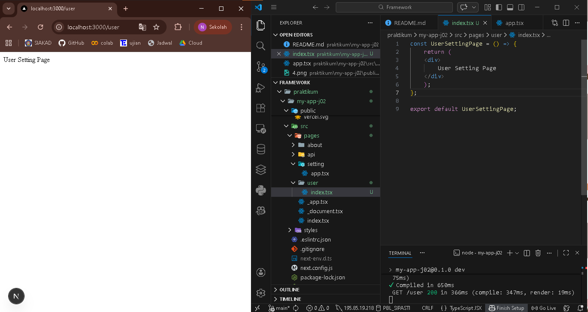

## 
LAPORAN PRAKTIKUM JOBSHEET 2

## 
Routing & Layouting pada Next.js (Pages Router)

  

  

  

## 
Oleh :

## 
Nova Eliza Maharani

## 
NIM. 2341720252 

  

## 
PROGRAM STUDI D-IV TEKNIK INFORMATIKA

## 
JURUSAN TEKNOLOGI INFORMASI

## 
POLITEKNIK NEGERI MALANG

## 
FEBRUARI 2026

  

## Hasil Praktikum

### 1. Routing Dasar (Static Routing)

### 2. Routing Menggunakan Folder

### 3. Nested Routing

### a. Buat Folder Setting
#### user.tsx

#### app.tsx

#### modifikasi folder user
