## 
LAPORAN PRAKTIKUM JOBSHEET 3

## 
LINK NAVIGATION

  

  

  

## 
Oleh :

## 
Nova Eliza Maharani

## 
NIM. 2341720252 

  

## 
PROGRAM STUDI D-IV TEKNIK INFORMATIKA

## 
JURUSAN TEKNOLOGI INFORMASI

## 
POLITEKNIK NEGERI MALANG

## 
FEBRUARI 2026

  

## Hasil Praktikum

### Langkah 1 - Menjalankan Project
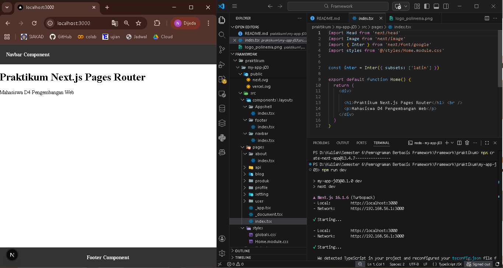

### Langkah 2 – Membuat Catch-All Route
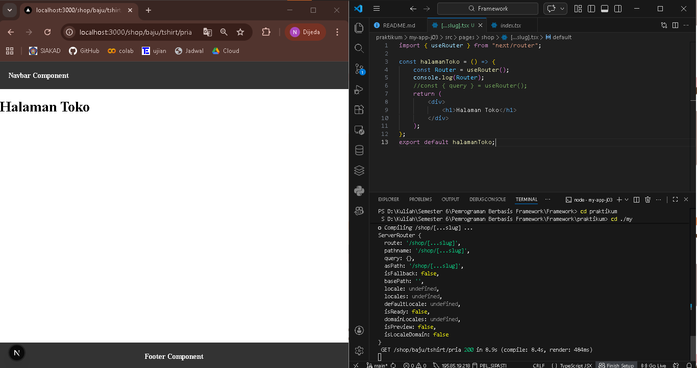
#### Modifikasi [...slug.tsx]
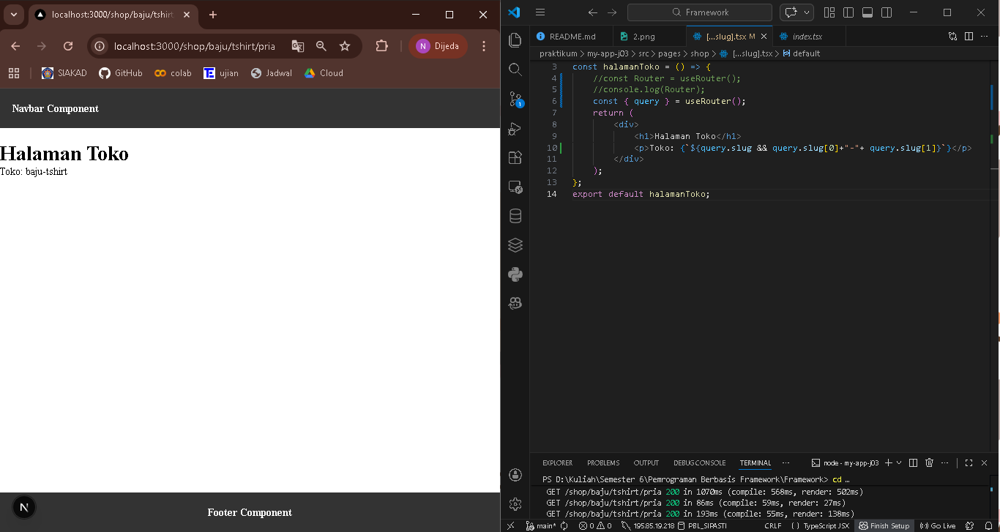

### Langkah 3 – Pengujian Catch-All Route

#### Hasil akses URL awal
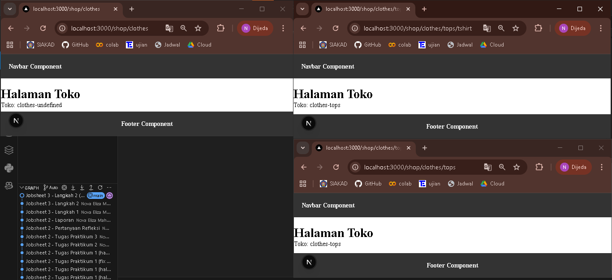
#### Modifikasi [...slug.tsx]
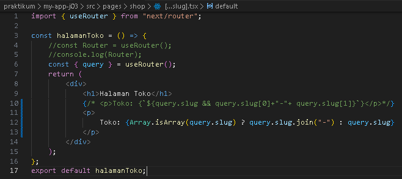
#### Hasil akses URL akhir
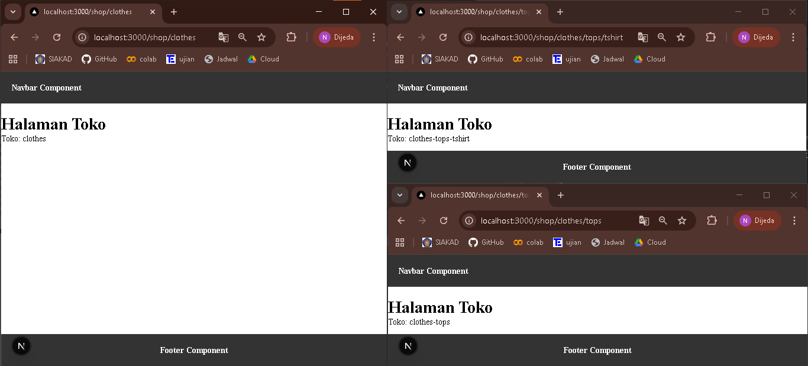
#### Mengembalikan kode awal
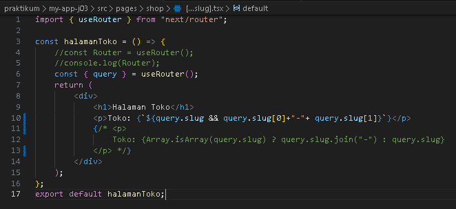

### Langkah 4 – Optional Catch-All Route

#### Menggunakan [...slug].tsx
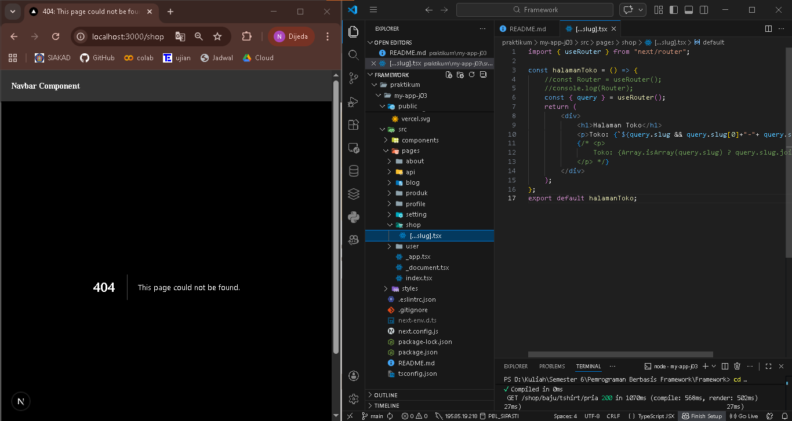
#### Modifikasi menjadi [[...slug.tsx]]
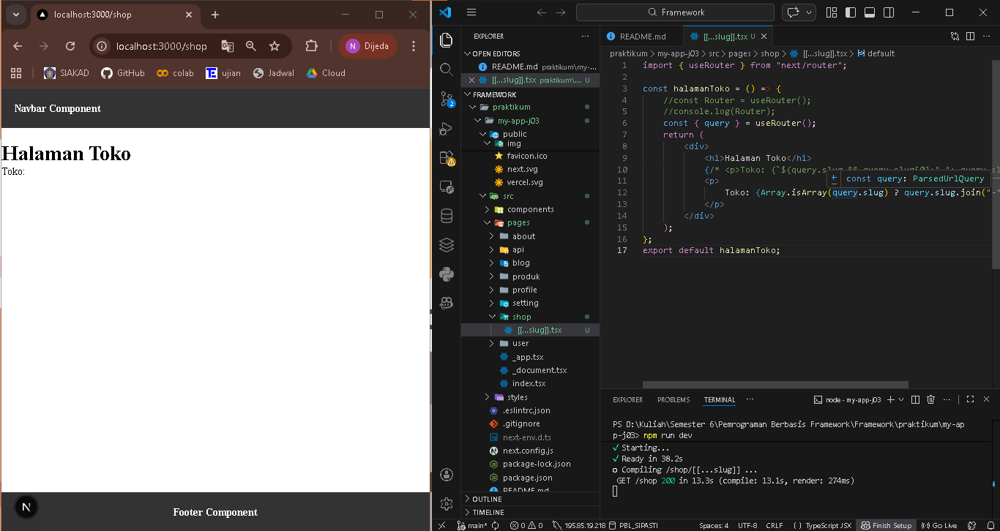

### Langkah 5 – Validasi Parameter
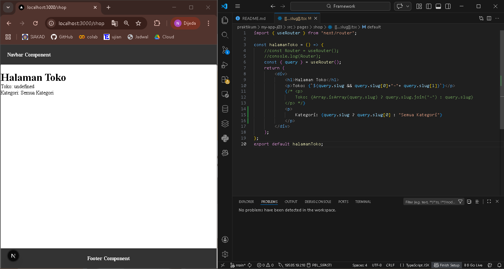

### Langkah 6 – Membuat Halaman Login & Register
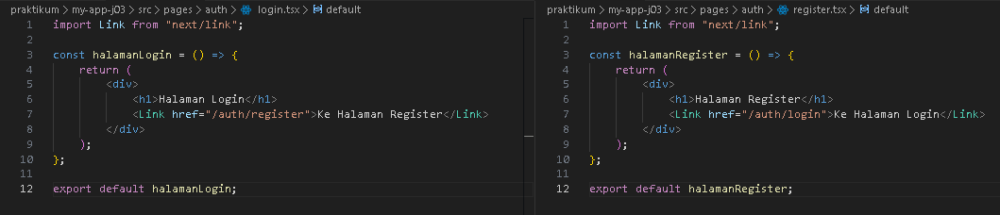

### Langkah 7 – Navigasi Imperatif (router.push)
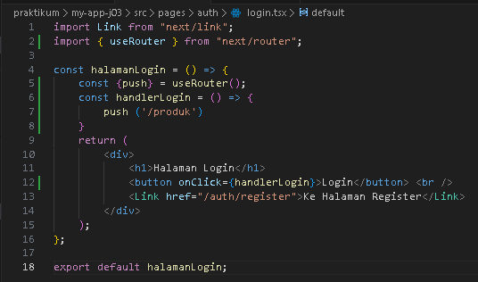
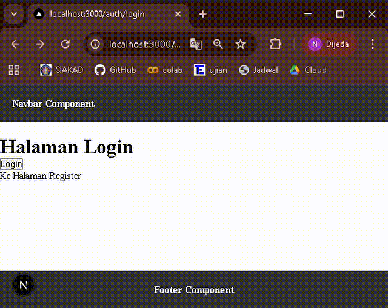

### Langkah 8 – Simulasi Redirect (Belum Login)
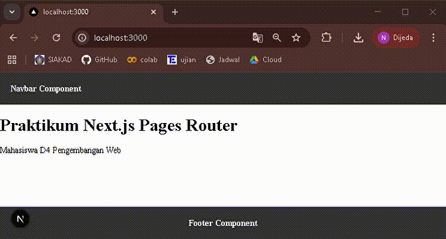

## Tugas Praktikum

### Tugas 1

### Tugas 2
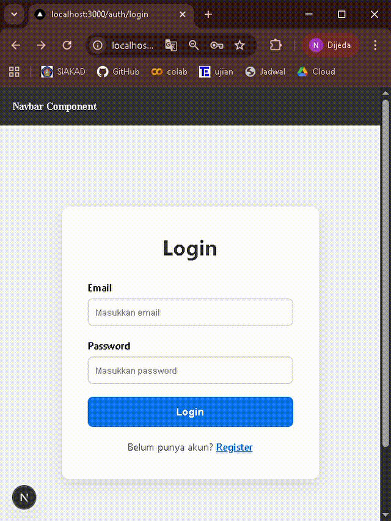
