## 
LAPORAN PRAKTIKUM JOBSHEET 4

## 
STYLING PADA NEXT.JS

  

  

  

## 
Oleh :

## 
Nova Eliza Maharani

## 
NIM. 2341720252 

  

## 
PROGRAM STUDI D-IV TEKNIK INFORMATIKA

## 
JURUSAN TEKNOLOGI INFORMASI

## 
POLITEKNIK NEGERI MALANG

## 
FEBRUARI 2026

  

## Hasil Praktikum

### Langkah 1 - Global CSS
#### a. File Global
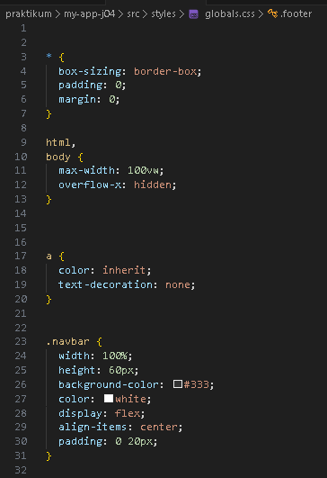
#### b. Import Global CSS
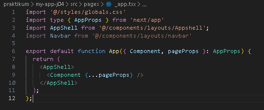

### Langkah 2 -  CSS Module (Local Scope)
#### a. Struktur Komponen Navbar
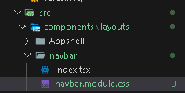
#### b. File CSS Module
- Modifikasi global.css
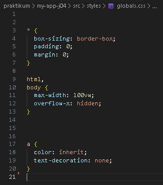
- Modifikasi navbar.module.css
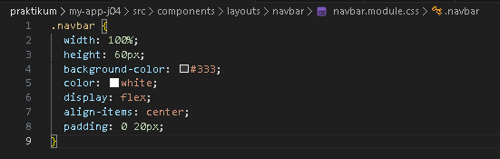
#### c. Pemanggilan di Komponen
- Modifikasi navbar/index.tsx
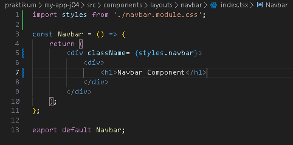
- Jalankan browser
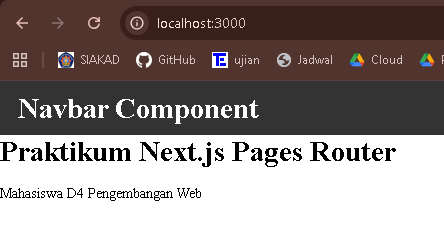

### Langkah 3 - Styling untuk Pages (CSS Module)
#### a. Contoh Login Page
- Membuat auth/login.module.css
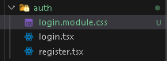
- Modifikasi login.module.css
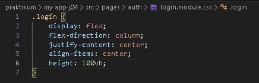
- Modifikasi login.tsx
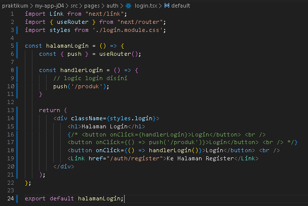
- Jalankan browser
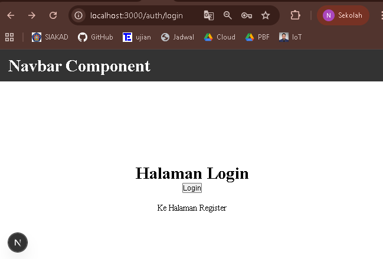

### Langkah 4 - Conditional Rendering Navbar (Tanpa Navbar di Login)

### Langkah 5 - Refactoring Struktur Project (Best Practice)
### a. Struktur Awal (Kurang Rapi)
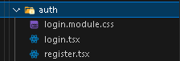
### b. Struktur Refactor (Disarankan)
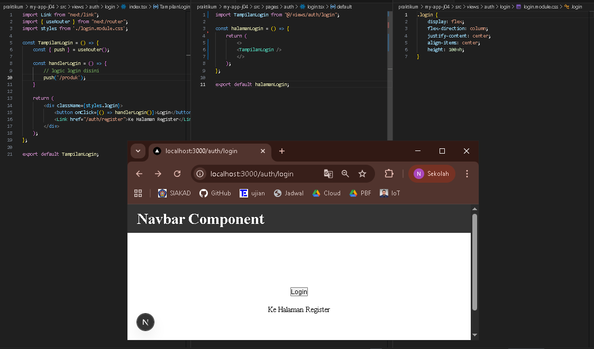

### Langkah 6 - Inline Styling (CSS-in-JS)
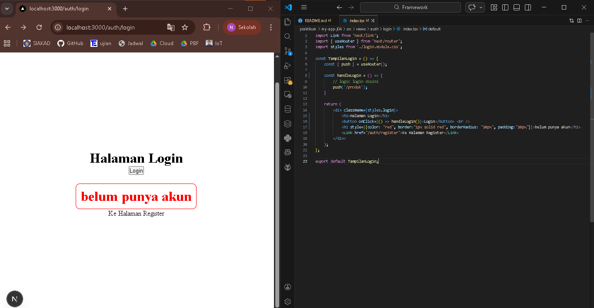

### Langkah 7 - Kombinasi Global CSS + CSS Module
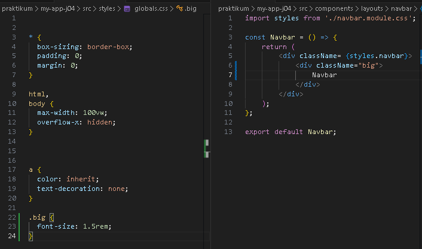

### Langkah 8 - SCSS (SASS)
#### a. Install SASS
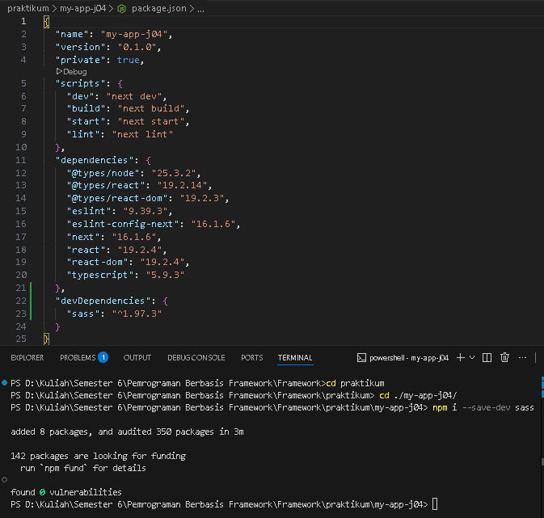
#### b. Global Variable
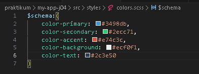
#### c. Gunakan di Module
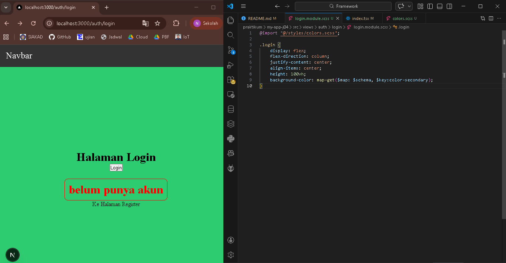

### Langkah 9 - Tailwind CSS
#### a. Install
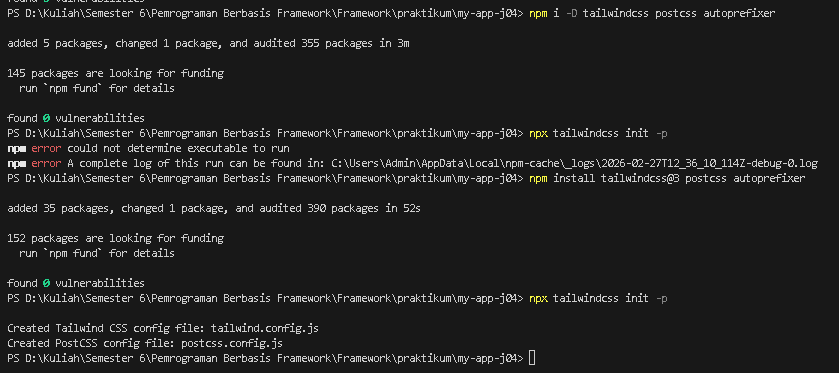
#### b. Konfigurasi tailwind.config.js
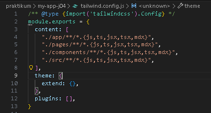
#### c. Import di Global CSS
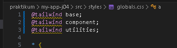
#### d. Contoh Penggunaan
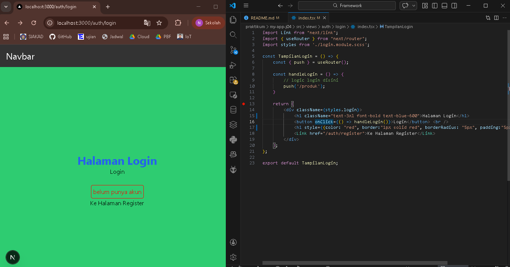

## Tugas Praktikum
### Tugas 1
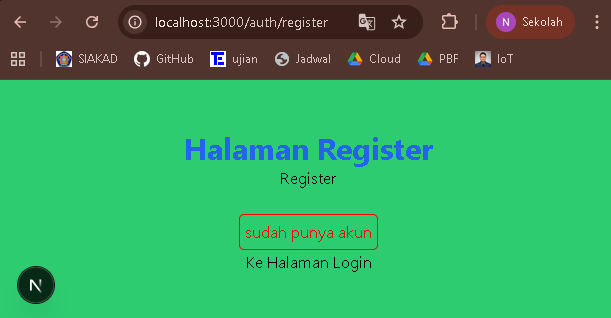

