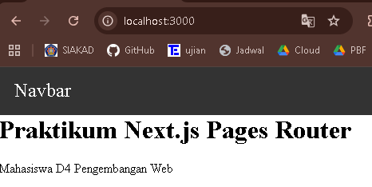
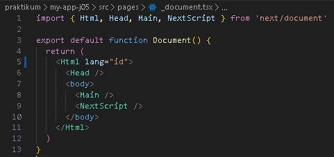
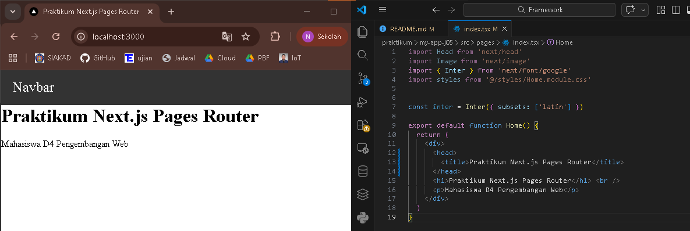
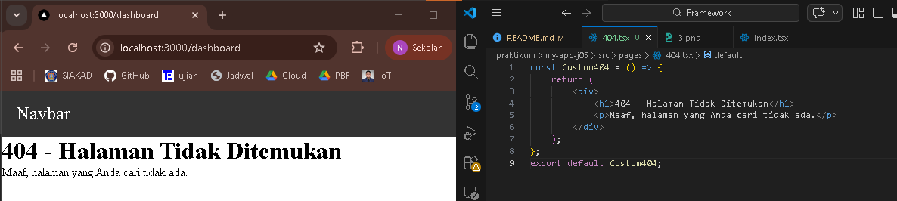
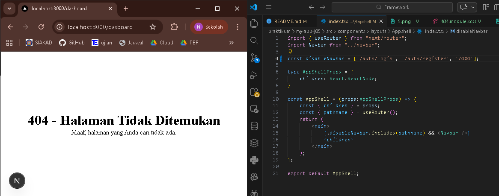

## 
LAPORAN PRAKTIKUM JOBSHEET 4

## 
STYLING PADA NEXT.JS

  

  

  

## 
Oleh :

## 
Nova Eliza Maharani

## 
NIM. 2341720252 

  

## 
PROGRAM STUDI D-IV TEKNIK INFORMATIKA

## 
JURUSAN TEKNOLOGI INFORMASI

## 
POLITEKNIK NEGERI MALANG

## 
FEBRUARI 2026

  

## Hasil Praktikum

### Langkah 1 - Menjalankan Project

### Langkah 2 – Membuat Custom Document

### Langkah 3 – Pengaturan Title per Halaman

### Langkah 4 – Membuat Custom Error Page (404)

### Langkah 5 – Styling Halaman 404

