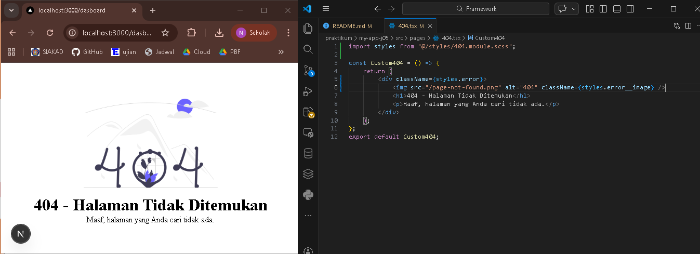
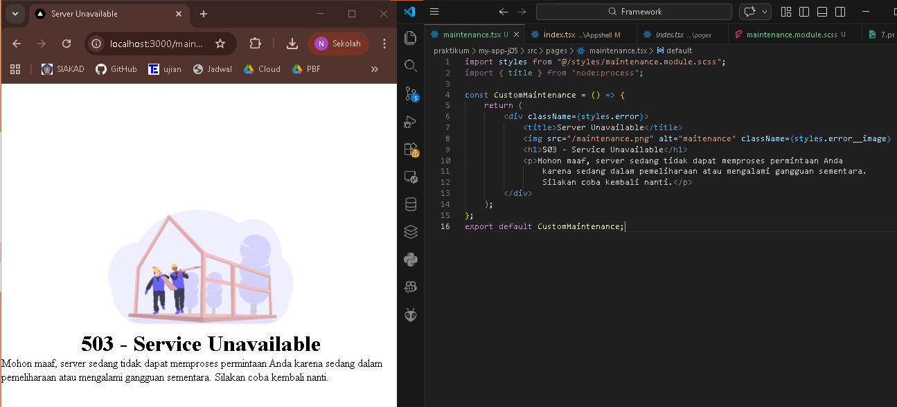
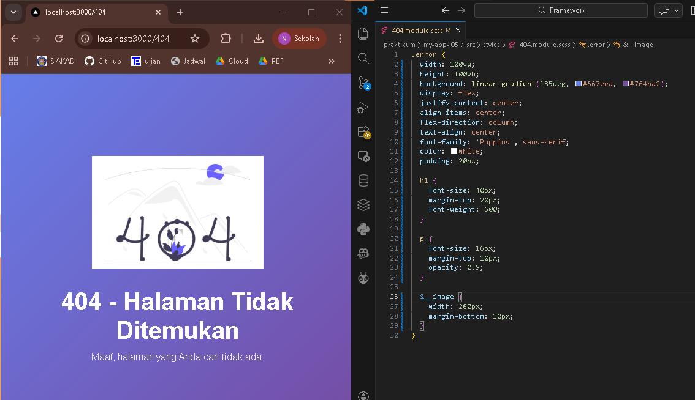

## 
LAPORAN PRAKTIKUM JOBSHEET 4

## 
STYLING PADA NEXT.JS

  

  

  

## 
Oleh :

## 
Nova Eliza Maharani

## 
NIM. 2341720252 

  

## 
PROGRAM STUDI D-IV TEKNIK INFORMATIKA

## 
JURUSAN TEKNOLOGI INFORMASI

## 
POLITEKNIK NEGERI MALANG

## 
FEBRUARI 2026

  

## Hasil Praktikum

### Langkah 1 - Menjalankan Project

### Langkah 2 – Membuat Custom Document

### Langkah 3 – Pengaturan Title per Halaman

### Langkah 4 – Membuat Custom Error Page (404)

### Langkah 5 – Styling Halaman 404

### Langkah 6 – Menampilkan Gambar dari Folder Public

## Tugas Praktikum

### Tugas 1

### Tugas 2

### Tugas 3

## Pertanyaan Evaluasi

### 1. Apa fungsi utama _document.js?
Jawab : Fungsi _document.js ialah untuk mengatur struktur HTML global untuk semua halaman (html, body, meta, font).
### 2. Mengapa <title> tidak disarankan di _document.js?
Jawab : Karena judul harus dinamis per halaman jika ``<title>`` diletakkan di _document.js maka judul akan sama di semua halaman
### 3. Apa perbedaan halaman biasa dan halaman 404.js?
Jawab : 
- Halaman biasa untuk konten normal, diakses via URL
- 404.js agar otomatis muncul untuk URL yang tidak ada atau sebagai menampilkan pesan error
### 4. Mengapa folder public tidak perlu di-import?
Jawab : Karena folder public merupakan folder untuk menyimpan aset statis sehingga bisa diakses langsung via path ``/gambar`` tanpa import terlebih dahulu

