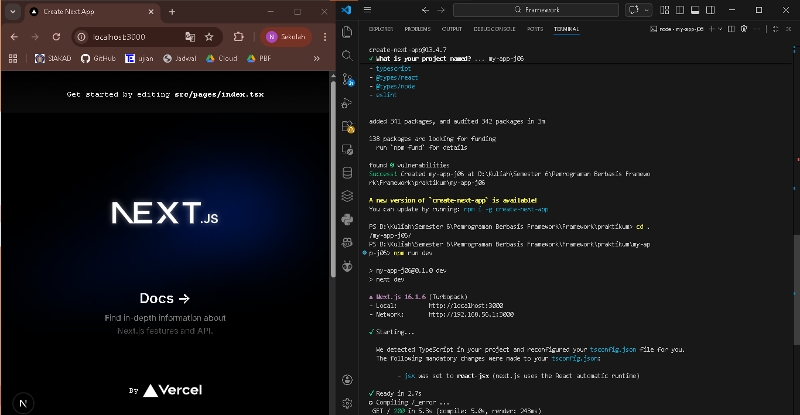
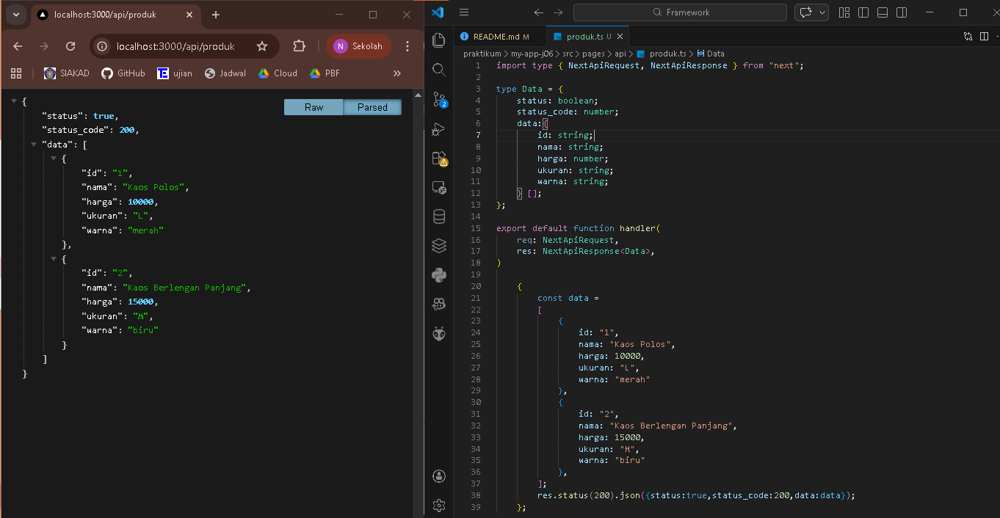
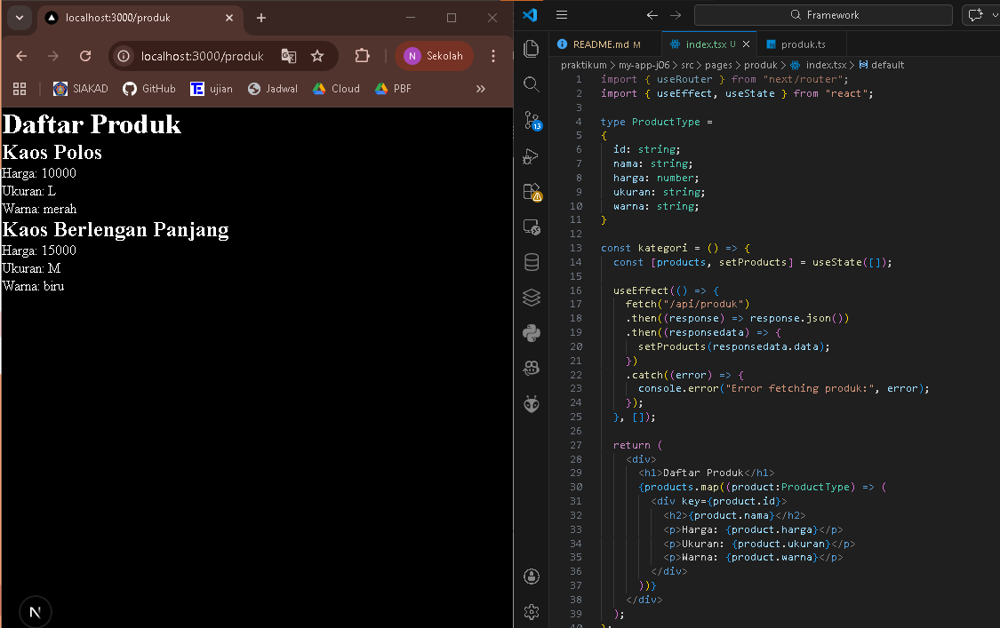
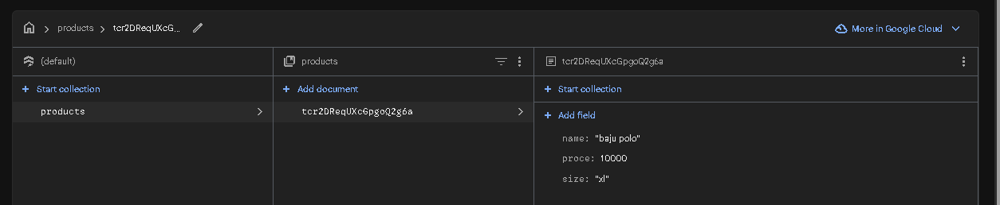
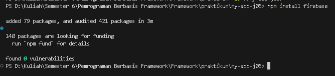
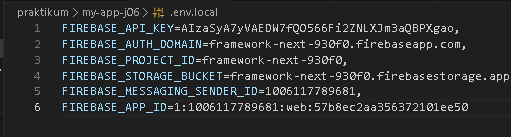
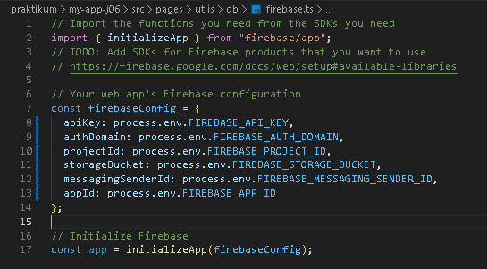
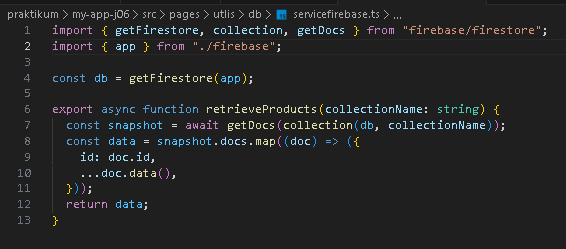

## 
LAPORAN PRAKTIKUM JOBSHEET 6

## 
API ROUTES

  

  

  

## 
Oleh :

## 
Nova Eliza Maharani

## 
NIM. 2341720252 

  

## 
PROGRAM STUDI D-IV TEKNIK INFORMATIKA

## 
JURUSAN TEKNOLOGI INFORMASI

## 
POLITEKNIK NEGERI MALANG

## 
FEBRUARI 2026

  

## Hasil Praktikum

### Langkah 1 – Menjalankan Project

### Langkah 2 – Membuat API Produk

### Langkah 3 – Fetch Data API di Frontend

## Integrasi Firebase

### Langkah 5 - Setup Firebase

Hasil set up Firebase

### Langkah 6 – Install Firebase

### Langkah 7 – Konfigurasi Environment Variable

### Langkah 8 – Konfigurasi Firebase

### Langkah 9 – Ambil Data dari Firestore

