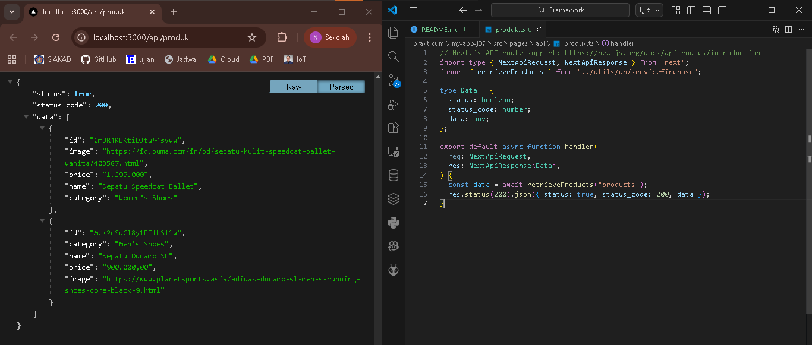
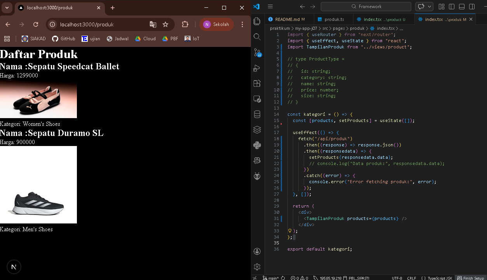
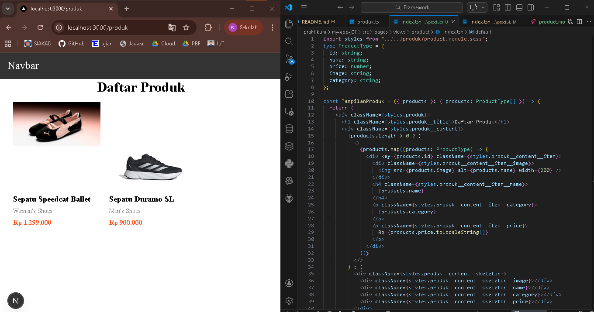
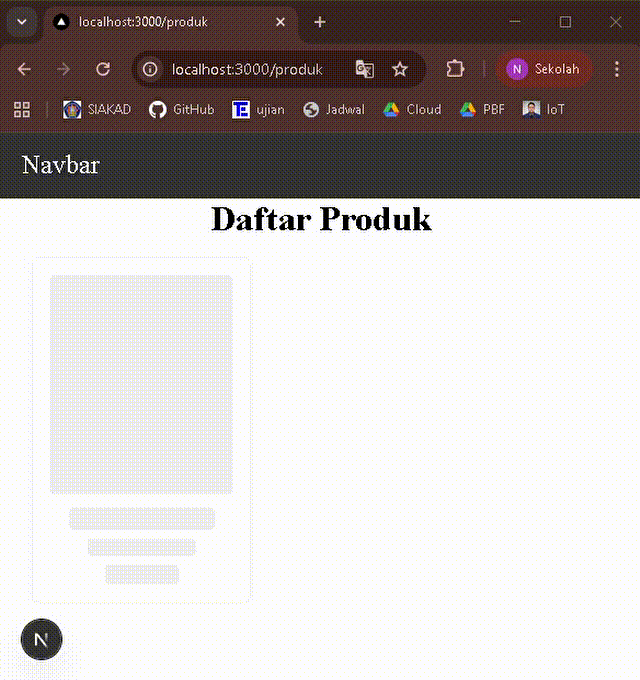
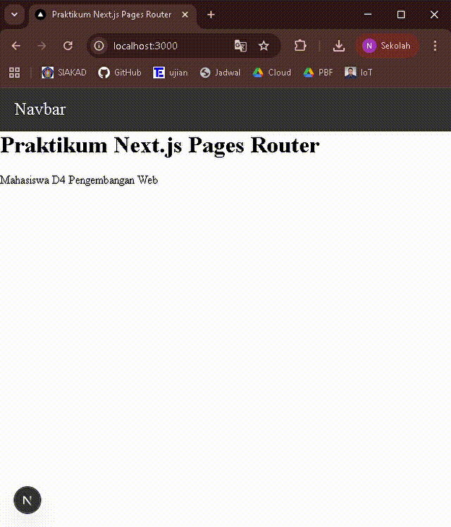

## 
LAPORAN PRAKTIKUM JOBSHEET 7

## 
CLIENT SIDE RENDERING

  

  

  

## 
Oleh :

## 
Nova Eliza Maharani

## 
NIM. 2341720252 

  

## 
PROGRAM STUDI D-IV TEKNIK INFORMATIKA

## 
JURUSAN TEKNOLOGI INFORMASI

## 
POLITEKNIK NEGERI MALANG

## 
MARET 2026

  

## Hasil Praktikum

### Langkah 1 – Setup Data Produk

### Langkah  2 – Implementasi CSR dengan useEffect

### Langkah 3 – Implementasi Skeleton Loading
- Animasi Skeleton

- Skeleton dan informasi

### Langkah 5 – Implementasi SWR

#### Perbandingan
- use Effect manual :
1. Update data : handle sendiri
2. Caching : tidak ada
3. Kode : panjang
4. Error / retry : manual
5. Install library : tidak
- SWR : 
1. Update data : otomatis update
2. Caching : ada otomatis
3. Kode : pendek dan rapi
4. Error / retry : bisa otomatis
5. Install library : perlu SWR

Kesimpulan : useEffect itu manual semua, kita pegang kendali penuh. Sedangkan SWR lebih otomatis, data dikelola sendiri dan kode bisa lebih sederhana.

## Tugas Praktikum

### Tugas 1
1. Jelaskan perbedaan:
- Client Side Rendering (CSR): Halaman dirender di browser. Loading awal lebih lambat, SEO kurang, tapi interaktifitas tinggi.
- Server Side Rendering (SSR): Halaman dirender di server setiap request. Loading cepat, SEO bagus, tapi server lebih sibuk.
- Static Site Generation (SSG): Halaman dirender sekali saat build. Loading sangat cepat, SEO optimal, tapi kurang cocok untuk konten yang sering berubah.