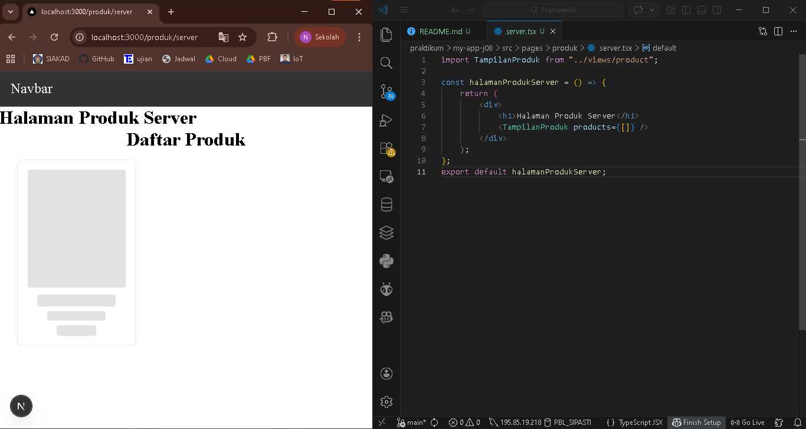
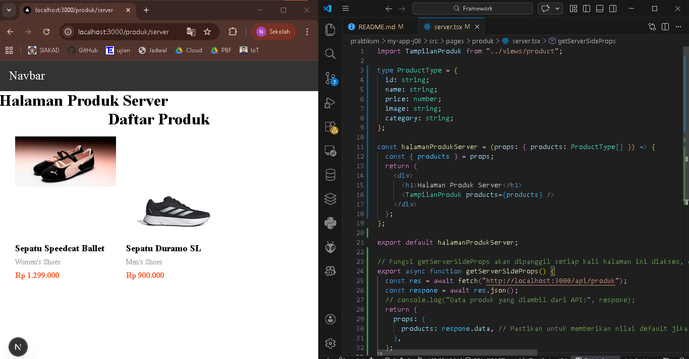
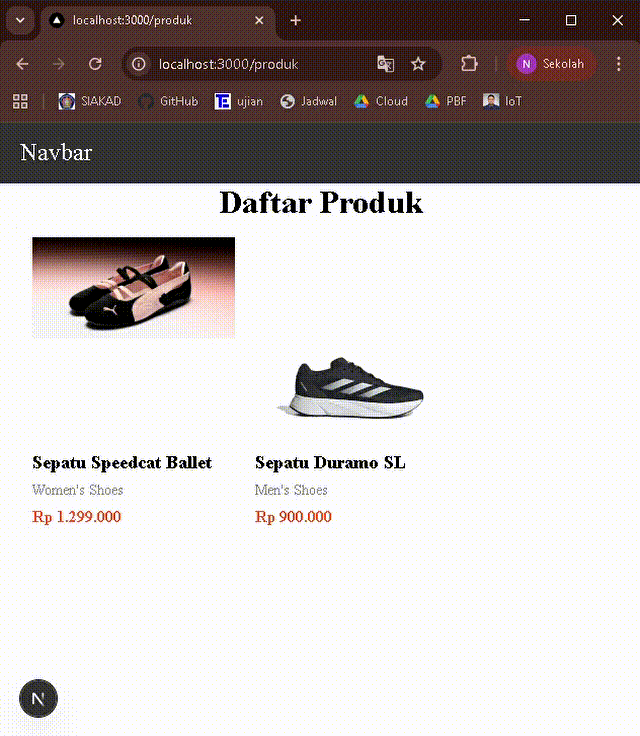
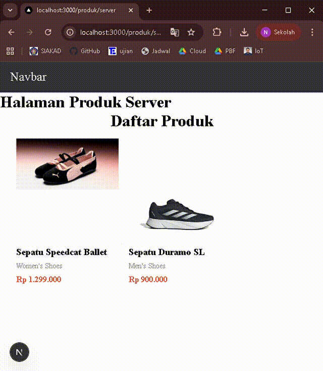
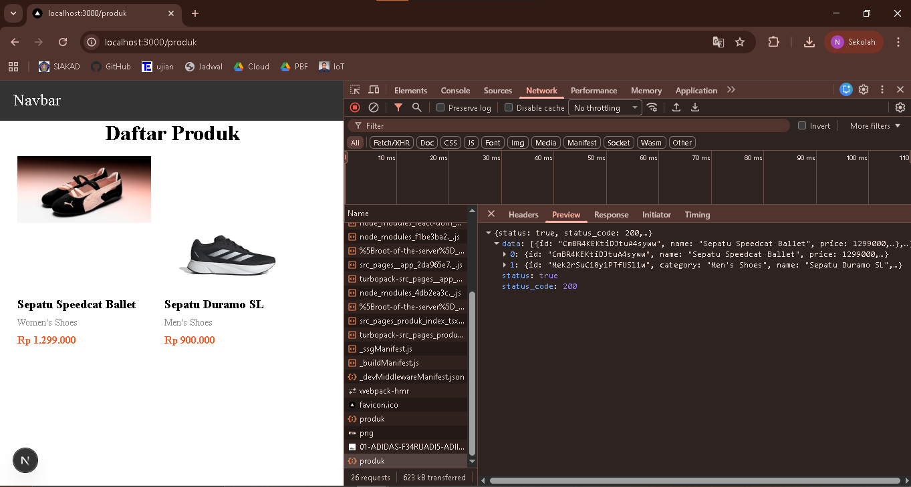
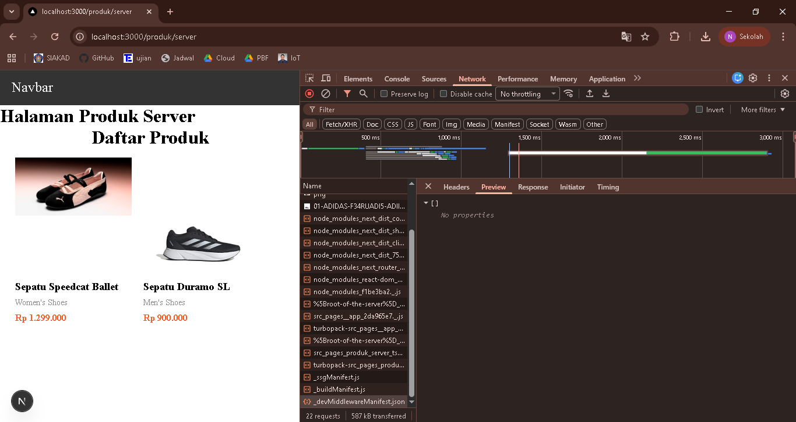
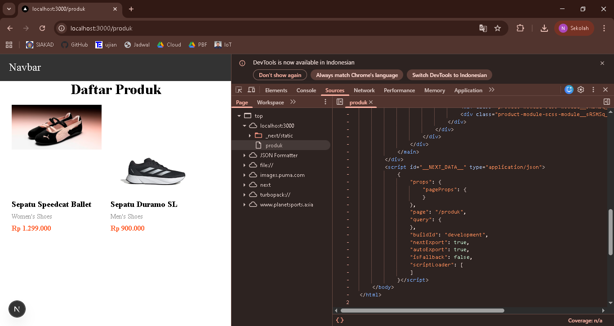
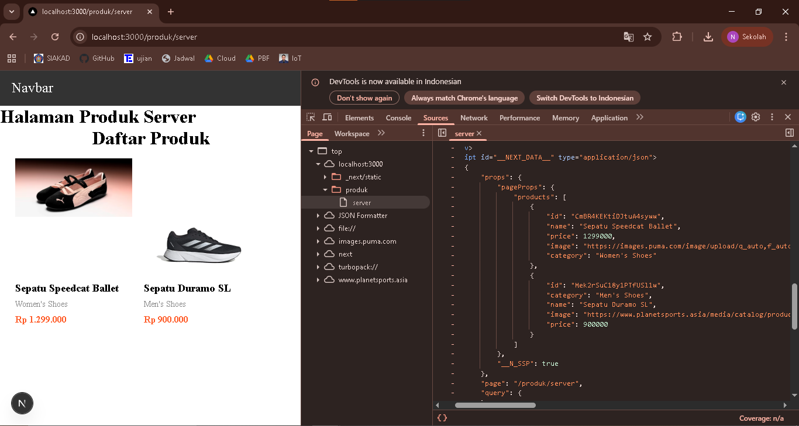

## 
LAPORAN PRAKTIKUM JOBSHEET 8

## 
SERVER SIDE RENDERING

  

  

  

## 
Oleh :

## 
Nova Eliza Maharani

## 
NIM. 2341720252 

  

## 
PROGRAM STUDI D-IV TEKNIK INFORMATIKA

## 
JURUSAN TEKNOLOGI INFORMASI

## 
POLITEKNIK NEGERI MALANG

## 
MARET 2026

  

## Hasil Praktikum

### Langkah 1 – Setup Halaman SSR

### Langkah 2 - Implementasi getServerSideProps pada server.tsx

### Langkah 3 - Refactor Type ( produk type )

### Langkah 4 - Uji Perbedaan SSR vs CSR

#### Uji 1 - Skeleton
- Halaman CSR (Skeleton muncul)

- Halaman SSR (Skeleton tidak muncul)

#### Uji 2 - Network Tab
- Halaman CSR (Request API terlihat)

- Halaman SSR (Request API tidak terlihat)

#### Uji 3 - Response HTML
- Halaman CSR (Skeleton muncul tapi sudah ada informasi pada jobsheet 7)

- Halaman SSR (Skeleton tidak muncul dan sudah ada data produk)

## Tugas Praktikum

### Tugas 1
- Halaman `/products` (CSR)

- Halaman `/products/server` (SSR)

### Tugas 2
- Network tab CSR

- Network tab SSR

- View Source CSR

- View Source SSR

