## 
LAPORAN PRAKTIKUM JOBSHEET 9

## 
STATIC SITE GENERATION

  

  

  

## 
Oleh :

## 
Nova Eliza Maharani

## 
NIM. 2341720252 

  

## 
PROGRAM STUDI D-IV TEKNIK INFORMATIKA

## 
JURUSAN TEKNOLOGI INFORMASI

## 
POLITEKNIK NEGERI MALANG

## 
MARET 2026

  

## Hasil Praktikum

### Langkah 1 – Setup Halaman Static
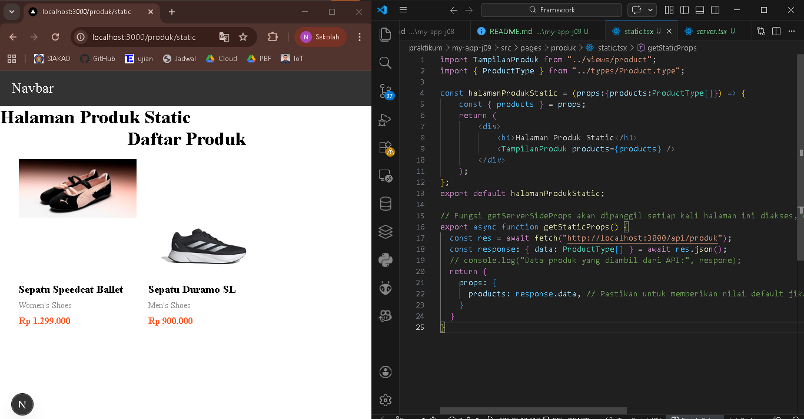

### Langkah 3 - Build Production Mode
- Build berhasil
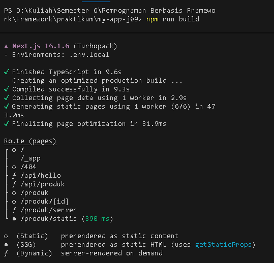
- Hasil `npm run start`
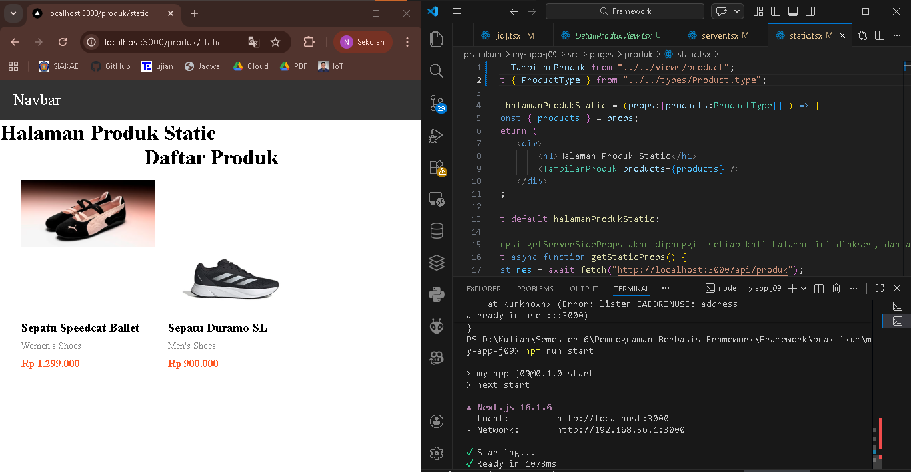

### Langkah 4 - Pengujian Perubahan Data

#### Uji 1 - Tambah Data di Database
1. Menambahkan data di firebase
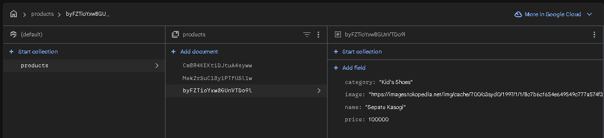
2. Hasil tiap halaman
- CSR (data bertambah)
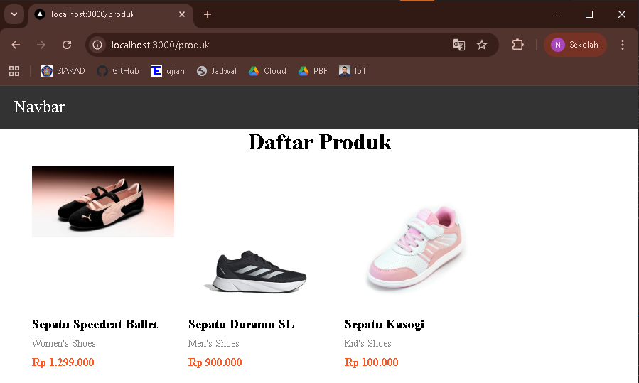
- SSR (data bertambah)

- SSG (data tidak berubah)
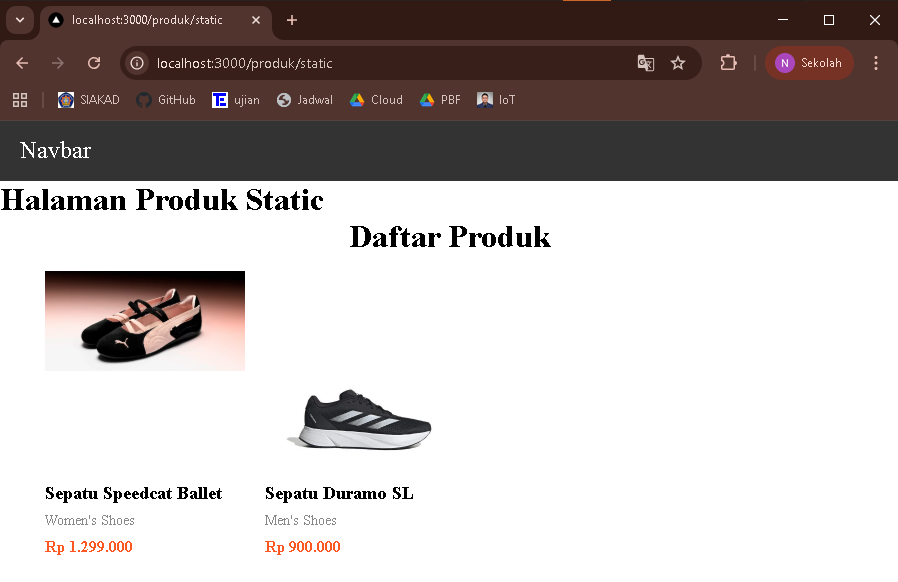

#### Uji 2 - Build Ulang
1. Menjalankan ulang
- `npm run build`
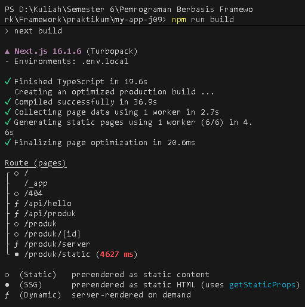
- `npm run start`
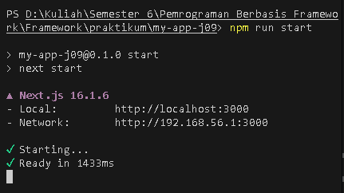
2. Hasil halaman static
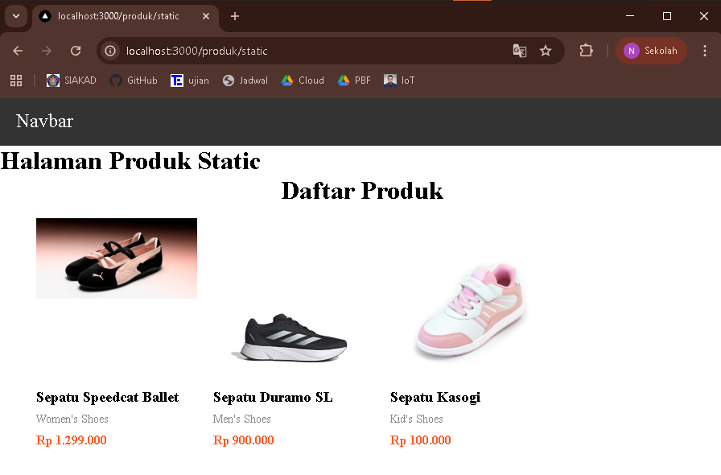

## Tugas Praktikum

### Tugas 1
1. Halaman CSR

2. Halaman SSR

3. Halaman SSG

### Tugas 2

1. Tambah Data
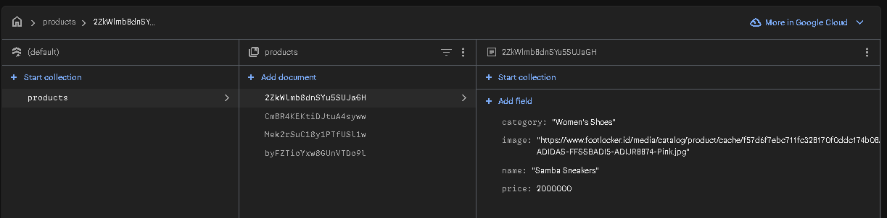
- CSR
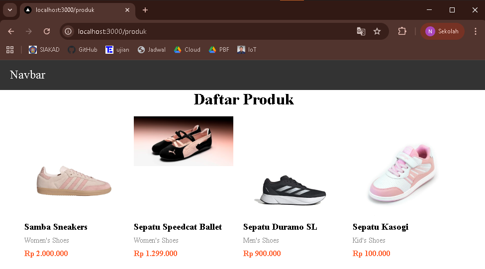
- SSR
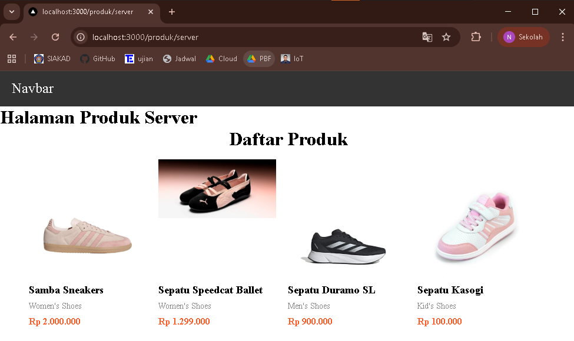
- SSG
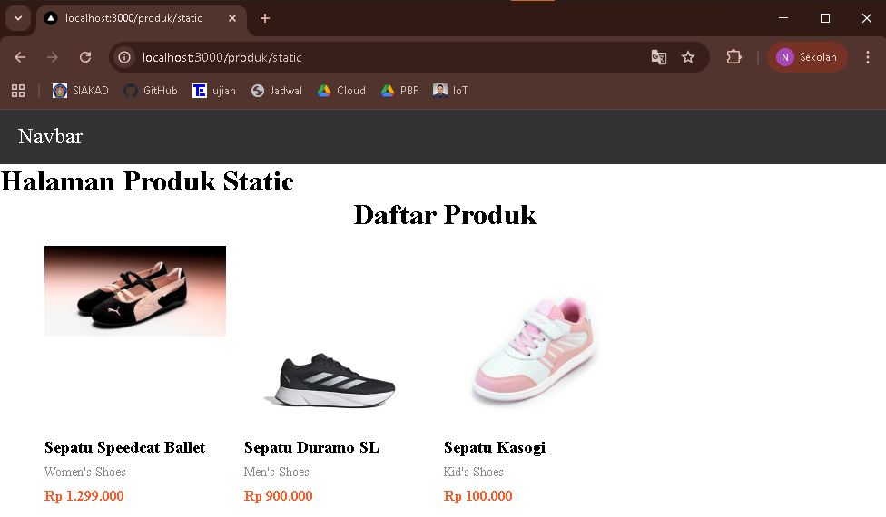
- SSG setelah build ulang
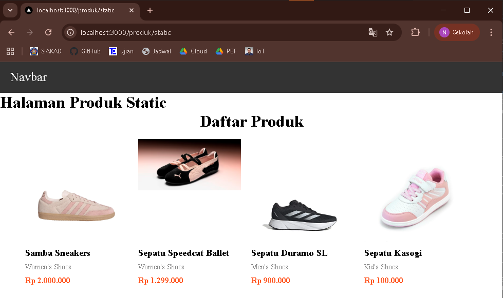

2. Hapus Data
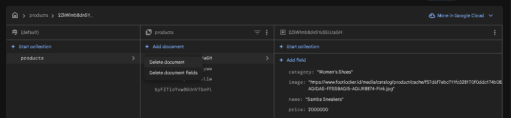
- CSR

- SSR

- SSG

- SSG setelah build ulang

Dari hasil diatas, ketika kita melakukan tambah dan hapus data, pada CSR dan SSR halaman akan otomatis terupdate. Berbeda dengan SSG yang harus build ulang dan menjalankannya lagi

