## 
LAPORAN PRAKTIKUM JOBSHEET 10

## 
DYNAMIC ROUTING

  

  

  

## 
Oleh :

## 
Nova Eliza Maharani

## 
NIM. 2341720252 

  

## 
PROGRAM STUDI D-IV TEKNIK INFORMATIKA

## 
JURUSAN TEKNOLOGI INFORMASI

## 
POLITEKNIK NEGERI MALANG

## 
MARET 2026

  

## Hasil Praktikum

### Langkah 1 – Membuat Dynamic Routing
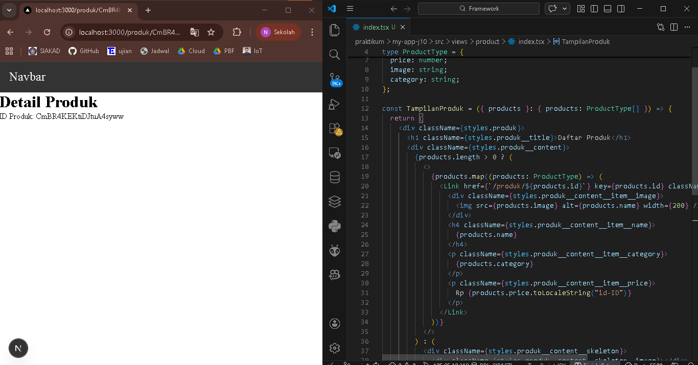

### Langkah 2 - Implementasi CSR (Client Rendering) 

- Hasil cek API produk
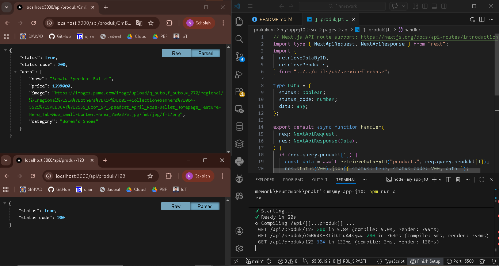

- Hasil Detail Produk ketika di klik
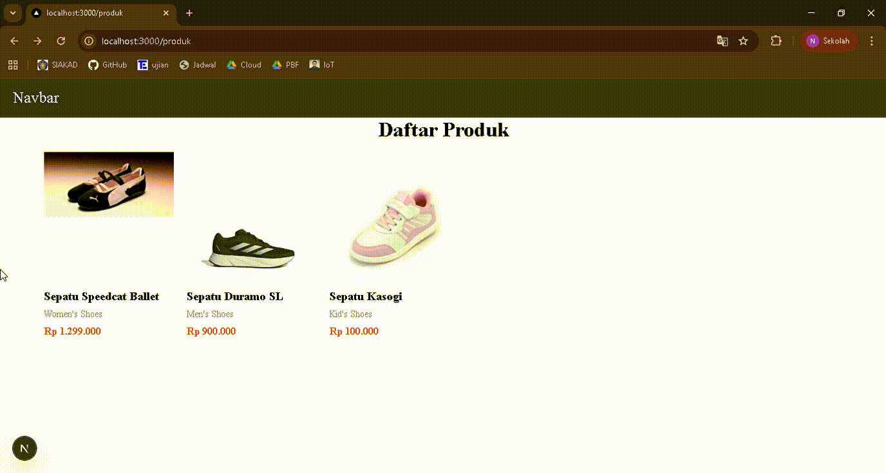

- Judul Detail Produk sudah ditengah
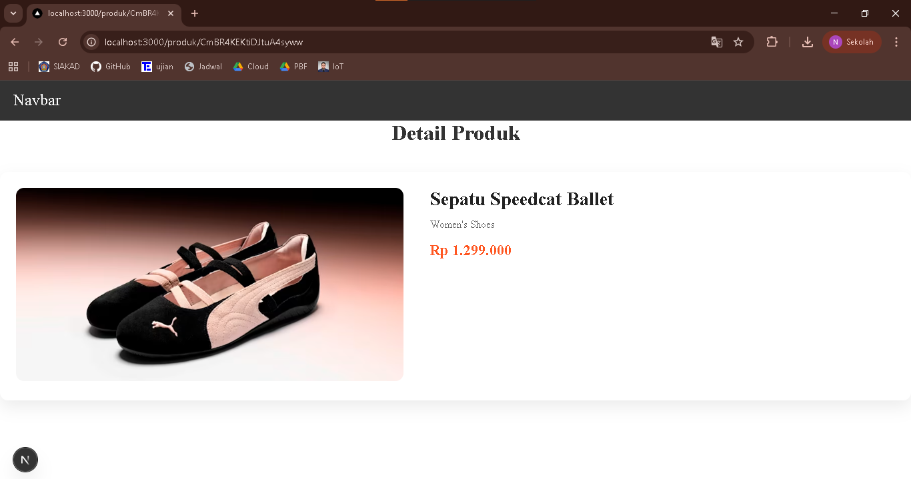

### Langkah 3 - Implementasi SSR
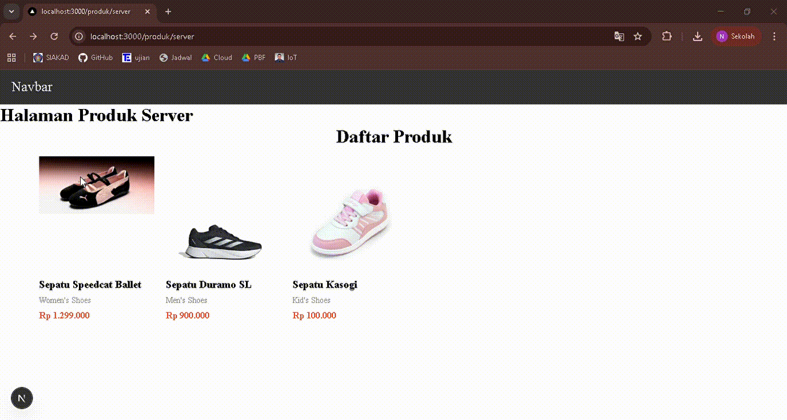

### Langkah 4 - Implementasi Static Site Generation (Dynamic SSG) 
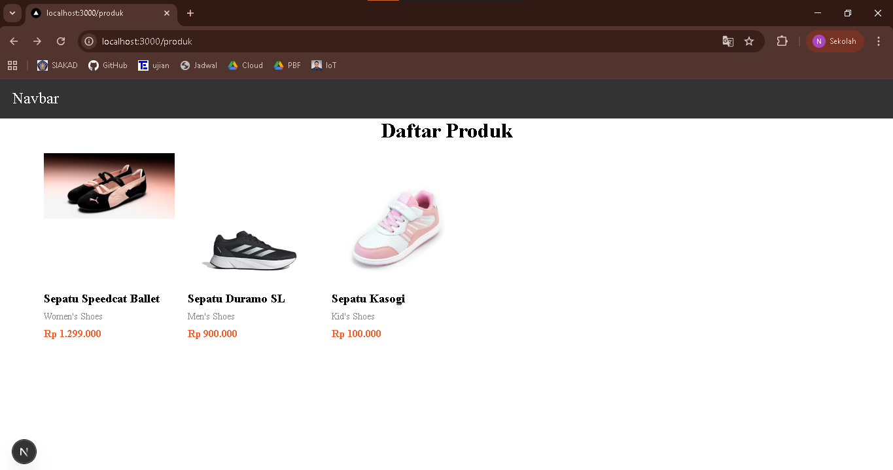
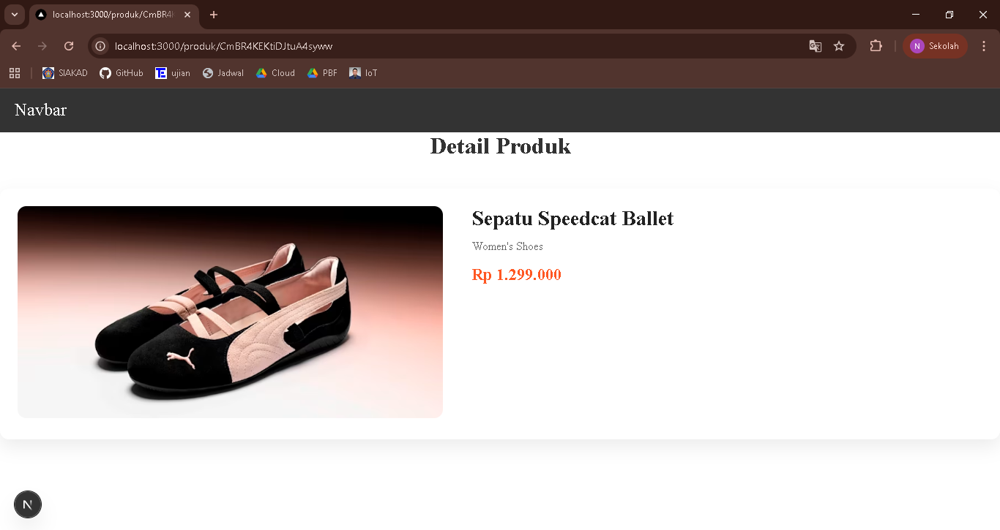

## Pengujian

### Uji 1 - CSR
Ada request API di network tab setelah detail produk di refresh
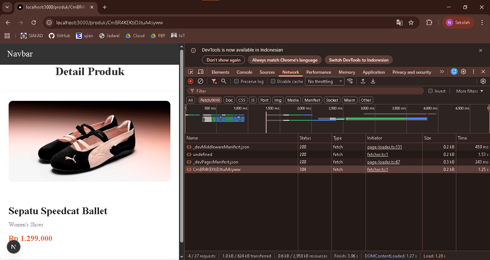

### Uji 2 - SSR
Ketika detail produk di refresh tidak ada request API
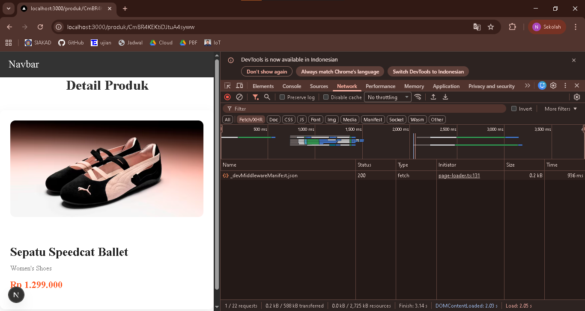

### Uji 3 - SSG

1. Hasil menjalankan `npm run build` dan `npm run start`
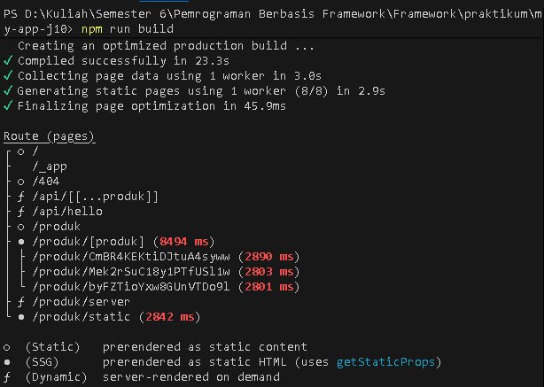
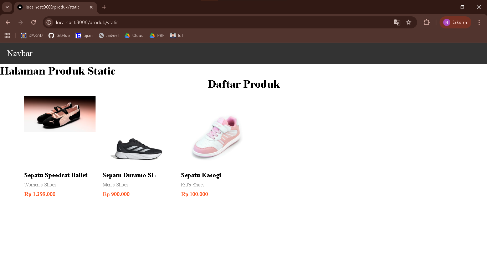

2. Menambahkan produk baru di database
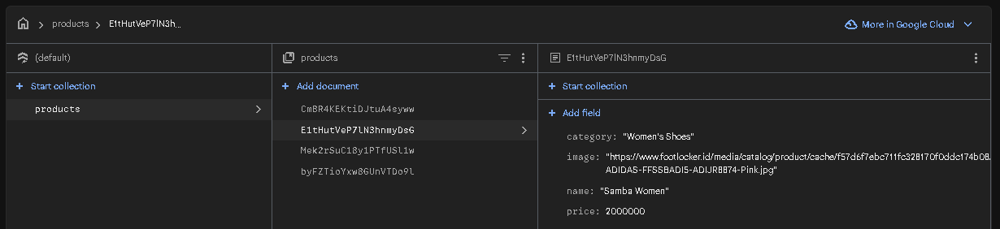

3. Halaman detail produk baru tidak muncul

4. Hasil menjalankan ulang `npm run build` dan `npm run start`. Produk yang baru ditambahkan muncul
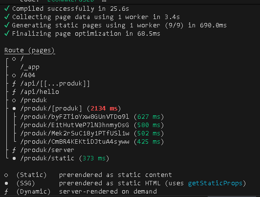
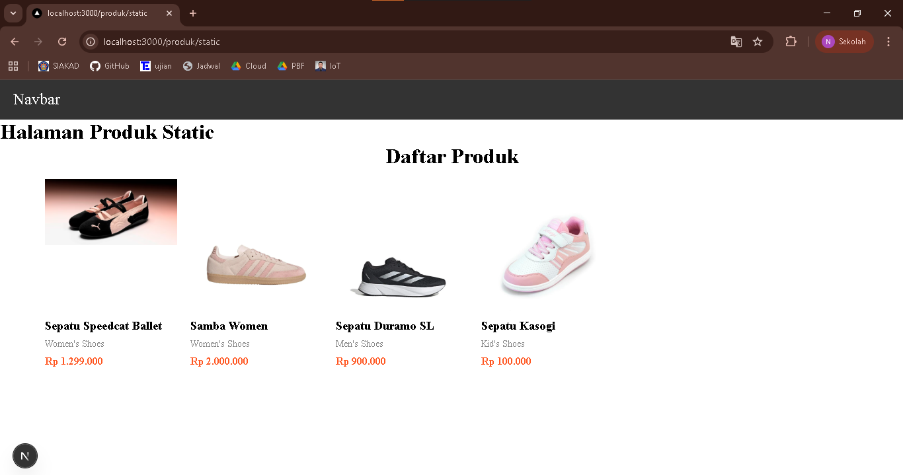

## Tugas Praktikum      

#### Tugas 1

1. CSR
2. SSR
3. SSG

Sudah diimplementasikan pada `DetailProduk/index.tsx`, dokumentasi akan saya jabarkan di tugas 3

#### Tugas 2
-------------------------------------------------------------------
| Aspek            | CSR       | SSR          | SSG               |
|------------------|-----------|--------------|-------------------|
| Loading          | Ada       | Cepat        | Cepat             |
| Build Required   | Tidak     | Tidak        | Ya                |
| SEO              | Kurang    | Optimal      | Optimal           |
| Perubahan Data   | Real-time | Tiap request | Harus rebuild     |
-------------------------------------------------------------------

#### Tugas 3

1. CSR

2. SSR

3. SSG
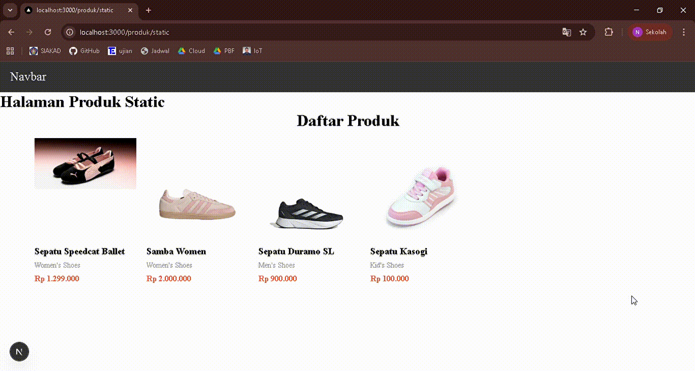

## F. Pertanyaan Analisis

1. Mengapa getStaticPaths wajib pada dynamic SSG?

Jawab : karena Next.js perlu tahu daftar path dinamis yang harus dibangun saat build time, sehingga halaman dynamic seperti /products/[id] bisa di-generate statis.

2. Mengapa CSR membutuhkan loading state?

Jawab : karena data diambil di browser saat runtime. apabila tanpa loading state, pengguna melihat layar kosong saat data belum selesai dimuat.

3. Mengapa SSG tidak menampilkan produk baru tanpa build ulang?

Jawab : karena konten di-generate statis saat build, jadi perubahan data baru tidak otomatis muncul di halaman yang sudah dibangun.

4. Mana metode terbaik untuk halaman detail e-commerce?

Jawab : Untuk halaman detail e-commerce, metode terbaik biasanya SSR (Server-Side Rendering) atau SSG dengan fallback/ISR, tergantung kebutuhan:
- SSR: Bagus kalau data sering berubah atau ada stok/price real-time, karena setiap request selalu dapat data terbaru.
- SSG + ISR: Bagus kalau mayoritas produk jarang berubah, tapi tetap ingin menampilkan produk baru tanpa build ulang penuh.
- CSR: Kurang ideal untuk SEO karena konten muncul setelah browser load; cocok untuk fitur interaktif tambahan, bukan halaman utama produk.

5. Apa risiko menggunakan SSG untuk produk yang sering berubah?

Jawab : informasi bisa kadaluarsa atau tidak akurat sampai halaman di-build ulang, menyebabkan pengalaman pengguna kurang up-to-date.