## 
LAPORAN PRAKTIKUM JOBSHEET 11

## 
INCREMENTAL STATIC REGENERATION

  

  

  

## 
Oleh :

## 
Nova Eliza Maharani

## 
NIM. 2341720252 

  

## 
PROGRAM STUDI D-IV TEKNIK INFORMATIKA

## 
JURUSAN TEKNOLOGI INFORMASI

## 
POLITEKNIK NEGERI MALANG

## 
MARET 2026

  

## C. Implementasi ISR Otomatis

### Langkah 1 – Tambahkan revalidate
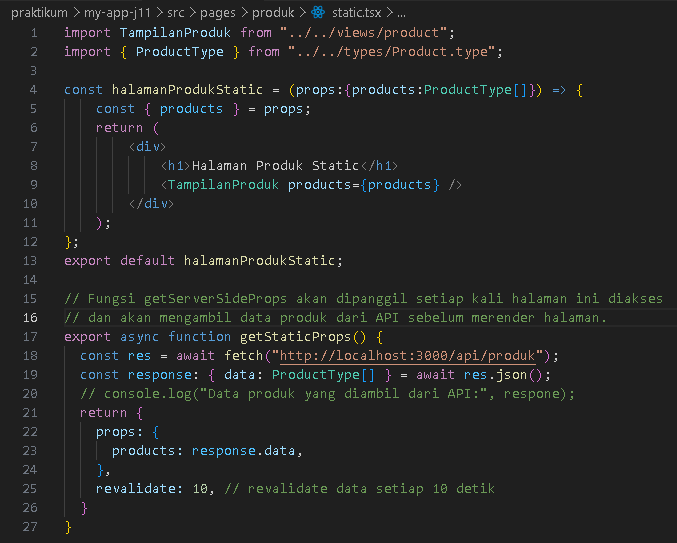

### Langkah 2 - Pengujian ISR
1. Hasil build
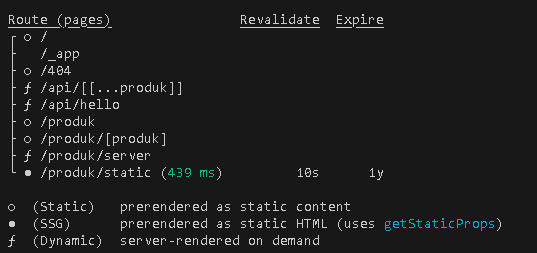
2. Hasil menambahkan data pada firebase
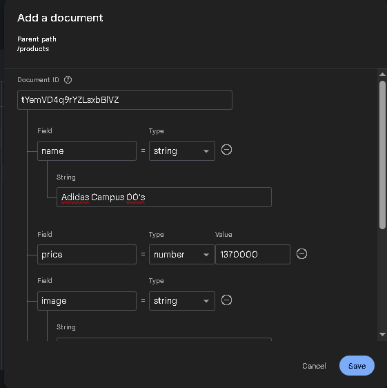
3. Hasil refresh
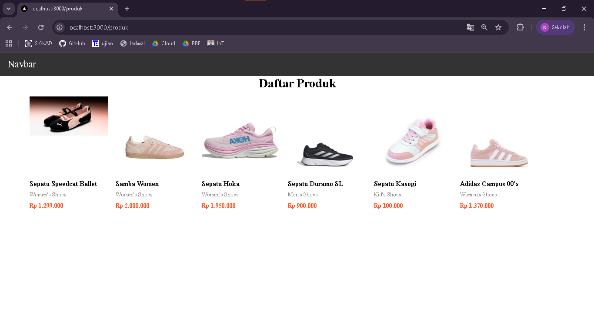

## D. On-Demand Revalidation 

### Langkah 1 - Buat API revalidate
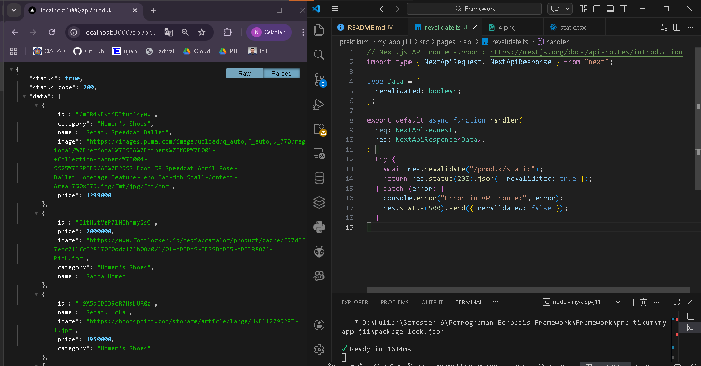

### Langkah 2 - Tambahkan Parameter Data
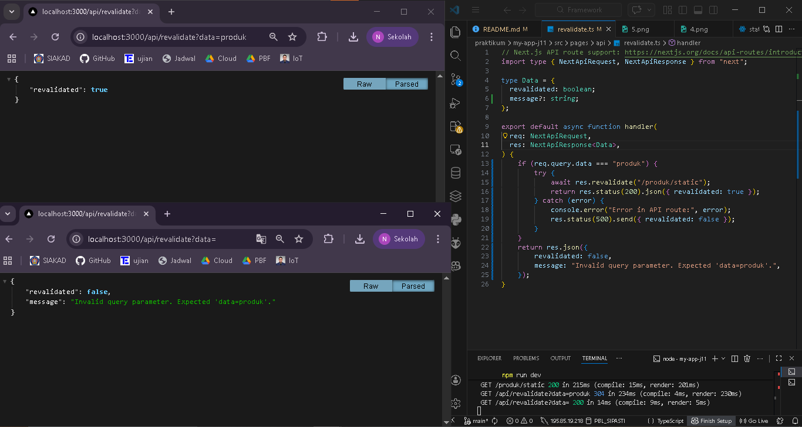

### Langkah 3 – Tambahkan Token Security
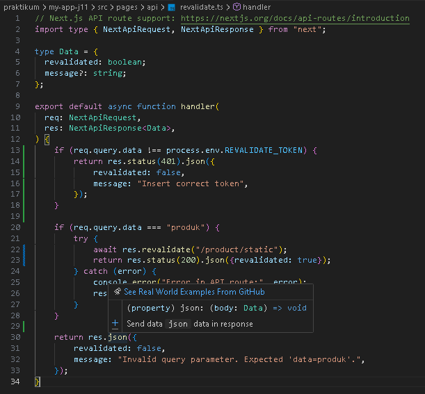

## E. Pengujian Manual Revalidation

- Hasil jika benar
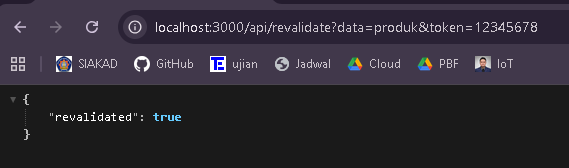

- Hasil jika salah
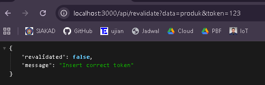

## F. Perbandingan SSG vs ISR
---------------------------------------------------------------
| Aspek            | SSG                | ISR                 |
|------------------|--------------------|---------------------|
| Update Data      | Harus build ulang  | Otomatis/Trigger    |
| Cache            | Static permanen    | Static+Refrseh      |
| Cocok untuk      | Konten tetap       | Konten semi-dinamis |
---------------------------------------------------------------

## G. Tugas Praktikum

1. Tambahkan lagi produk pada firebase
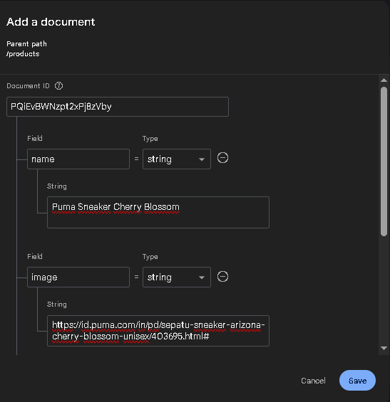

2. Implementasikan ISR dengan revalidate: 10.
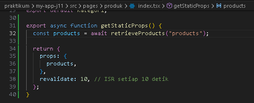

3. Tambahkan endpoint On-Demand Revalidation.

4. Tambahkan validasi token.
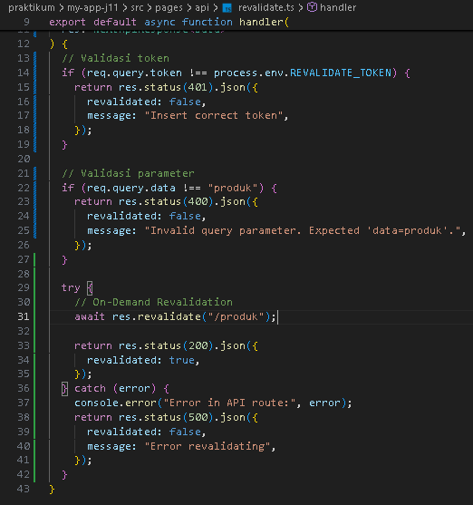

5. Uji dengan:

- Token benar
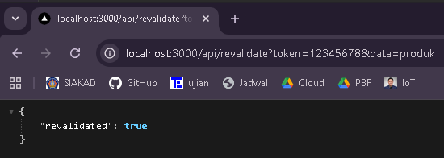

- Token salah
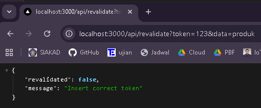

- Tanpa token
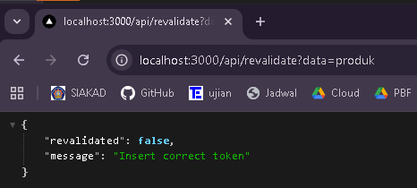