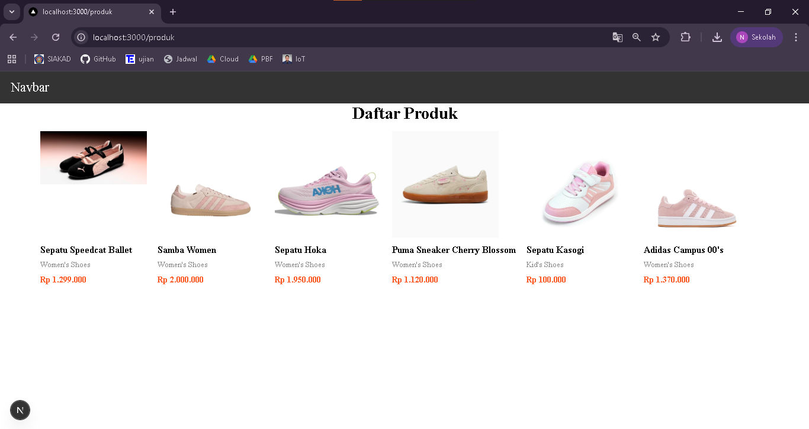
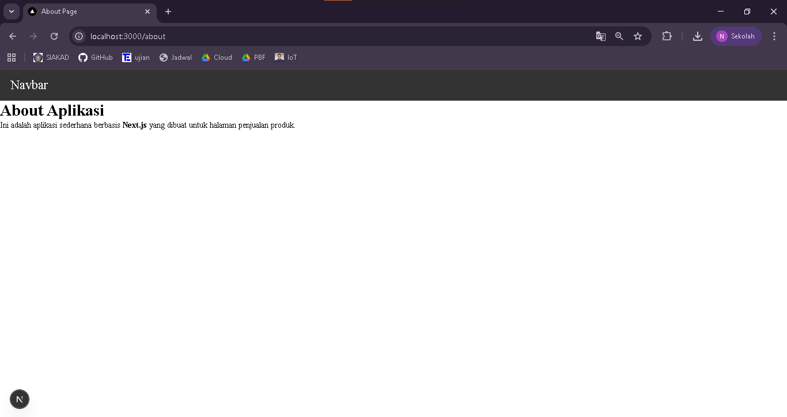
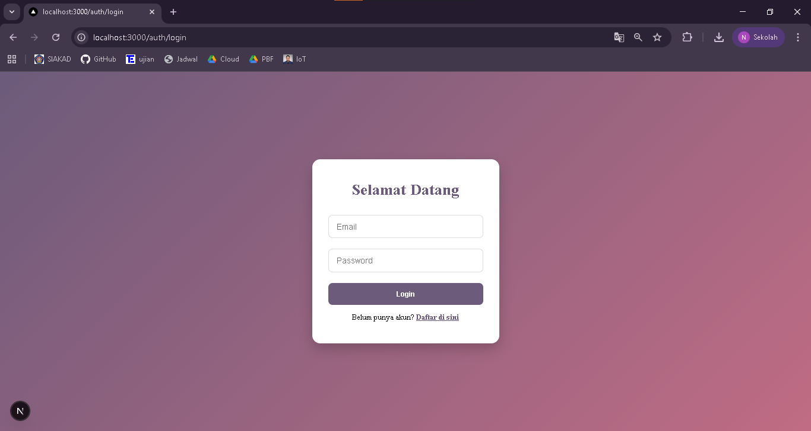
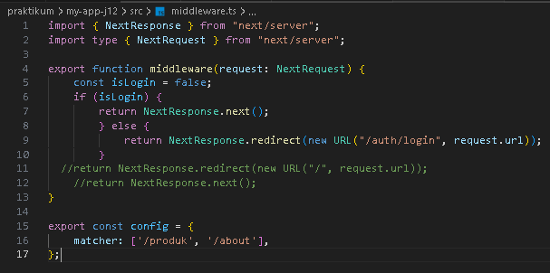
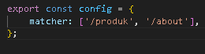

## 
LAPORAN PRAKTIKUM JOBSHEET 12

## 
MIDDLEWARE & ROUTE PROTECTION

  

  

  

## 
Oleh :

## 
Nova Eliza Maharani

## 
NIM. 2341720252 

  

## 
PROGRAM STUDI D-IV TEKNIK INFORMATIKA

## 
JURUSAN TEKNOLOGI INFORMASI

## 
POLITEKNIK NEGERI MALANG

## 
MARET 2026

  

## C. Langkah Praktikum

### Langkah 1 – Membuat Middleware

### Langkah 2 - Struktur Dasar Middleware

### Langkah 3 – Redirect Sederhana 

### Langkah 4 – Batasi Route Tertentu 

### Langkah 5 – Simulasi Sistem Login 

## D. Pengujian

### Uji 1 – isLogin = false

### Uji 2 – isLogin = true

### Uji 3 – Tambahkan Multiple Route 

## E. Perbandingan Middleware vs useEffect
------------------------------------------------------------------- 
| Aspek              | useEffect           | Middleware           |
|--------------------|---------------------|----------------------|
| Redirect timing    | Setelah render      | Sebelum render       |
| Glitch             | Ada                 | Tidak                |
| Security           | Lemah               | Lebih aman           |
| Skalabilitas       | Harus tiap halaman  | Sekali di middleware |
-------------------------------------------------------------------

## F. Tugas Praktikum

1. Buat halaman 

- /products

- /about

- /login

2. Implementasikan Middleware

- Redirect ke /login jika belum login.
- Izinkan akses jika login true.

3. Tambahkan proteksi hanya untuk route tertentu.

4. Dokumentasikan:
- Screenshot sebelum dan sesudah redirect.
- Sebelum 

- Sesudah

- Perbandingan dengan useEffect.
- useEffect
1. Redirect terjadi setelah komponen tampil
2. User bisa melihat halaman sebentar (glitch)
3. Lebih mudah tapi kurang aman
- Middleware / proteksi awal
1. Redirect terjadi sebelum halaman ditampilkan
2. Tidak ada flicker/glitch
3. Lebih profesional dan aman

## G. Pertanyaan Analisis

1. Mengapa middleware lebih aman dibanding useEffect?

Jawab : Middleware dijalankan sebelum halaman dirender, sehingga user yang belum login tidak pernah melihat konten halaman. Sedangkan useEffect baru dijalankan setelah komponen tampil, sehingga halaman sempat terlihat, walaupun akhirnya redirect terjadi. Jadi middleware lebih aman karena konten tidak terekspos.

2. Mengapa middleware tidak menimbulkan glitch?

Jawab : Karena redirect terjadi sebelum browser menampilkan halaman, user langsung diarahkan ke halaman yang sesuai. Dengan useEffect, halaman pertama kali dirender lalu baru redirect, sehingga ada flicker/glitch sementara konten asli terlihat.

3. Apa risiko jika semua halaman diproteksi tanpa pengecualian?

Jawab : 
- User baru atau pengunjung tidak bisa mengakses halaman publik (misal halaman About, Login, Register).
- Bisa menimbulkan loop redirect jika halaman login juga diproteksi.
- Membuat aplikasi kurang user-friendly karena semua konten terkunci.

4. Kapan middleware tidak diperlukan?

Jawab : 
- Jika halaman bersifat publik / bebas diakses (contoh: About, Landing Page, Blog).
- Jika hanya menggunakan login sederhana untuk latihan atau project kecil.

5. Apa perbedaan middleware dan API route?

Jawab :
| Aspek          | Middleware                              | API Route                             |
| -------------- | --------------------------------------- | ------------------------------------- |
| Tujuan         | Intercept request / redirect / proteksi | Menyediakan data / logic server-side  |
| Waktu eksekusi | Sebelum halaman dirender                | Saat request ke endpoint API          |
| Return konten  | Bisa redirect atau modifikasi response  | Mengembalikan JSON / data / status    |
| Contoh         | Proteksi halaman login                  | GET `/api/produk` -> ambil data produk |
