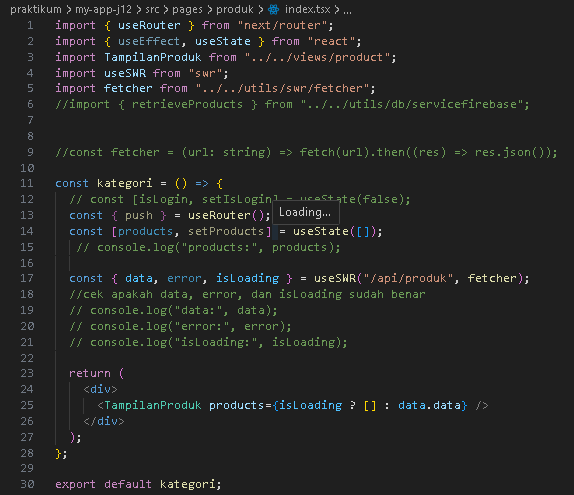
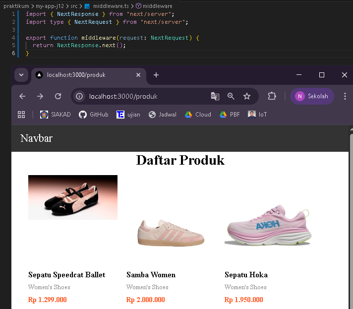
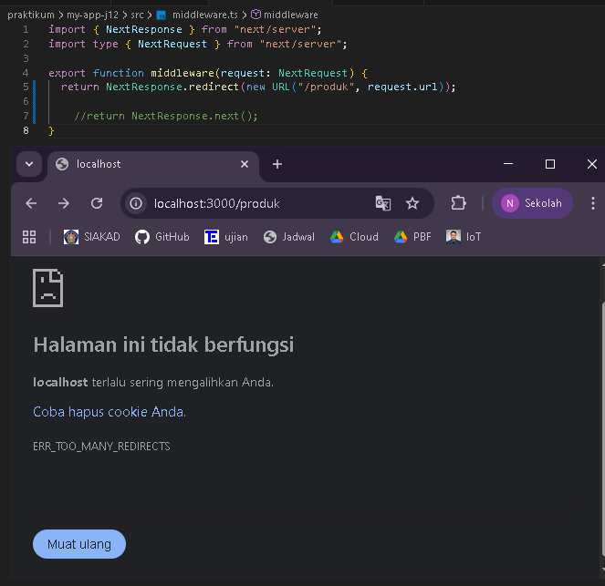
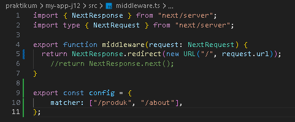
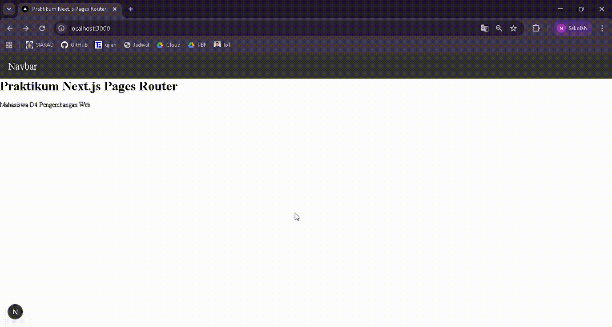
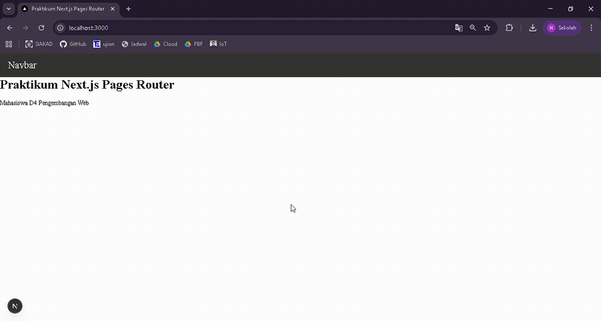

## 
LAPORAN PRAKTIKUM JOBSHEET 12

## 
MIDDLEWARE & ROUTE PROTECTION

  

  

  

## 
Oleh :

## 
Nova Eliza Maharani

## 
NIM. 2341720252 

  

## 
PROGRAM STUDI D-IV TEKNIK INFORMATIKA

## 
JURUSAN TEKNOLOGI INFORMASI

## 
POLITEKNIK NEGERI MALANG

## 
MARET 2026

  

## C. Langkah Praktikum

### Langkah 1 – Membuat Middleware

### Langkah 2 - Struktur Dasar Middleware

### Langkah 3 – Redirect Sederhana 

### Langkah 4 – Batasi Route Tertentu 

### Langkah 5 – Simulasi Sistem Login 

## D. Pengujian

### Uji 1 – isLogin = false

### Uji 2 – isLogin = true

### Uji 3 – Tambahkan Multiple Route 

## E. Perbandingan Middleware vs useEffect
------------------------------------------------------------------- 
| Aspek              | useEffect           | Middleware           |
|--------------------|---------------------|----------------------|
| Redirect timing    | Setelah render      | Sebelum render       |
| Glitch             | Ada                 | Tidak                |
| Security           | Lemah               | Lebih aman           |
| Skalabilitas       | Harus tiap halaman  | Sekali di middleware |
-------------------------------------------------------------------