## <p align = "center">LAPORAN PRAKTIKUM JOBSHEET 13</p>
## <p align = "center">SISTEM AUTENTIKASI & PROTEKSI ROUTE</p>

<br><br>

<p align="center">
  
</p>

<br><br>

## <p align = "center">Oleh :</p>
## <p align = "center">Nova Eliza Maharani</p>
## <p align = "center">NIM. 2341720252 </p>

<br><br>

## <p align = "center">PROGRAM STUDI D-IV TEKNIK INFORMATIKA</p>
## <p align = "center">JURUSAN TEKNOLOGI INFORMASI</p>
## <p align = "center">POLITEKNIK NEGERI MALANG</p>
## <p align = "center">MARET 2026</p>

<br><br>

## C. Langkah Praktikum

### Langkah 1 – Install NextAuth
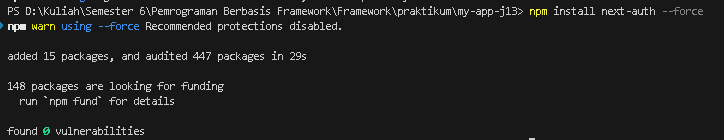

### Langkah 2 – Konfigurasi API Auth
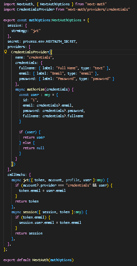

### Langkah 3 – Tambahkan Secret
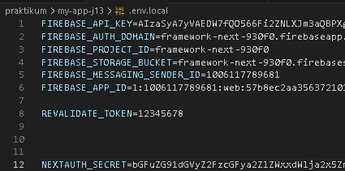

### Langkah 4 - Tambahkan SessionProvider
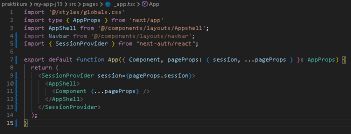

### Langkah 5 - Tambahkan Tombol Login & Logout

1. Hasil menjalankan ``http://localhost:3000/``
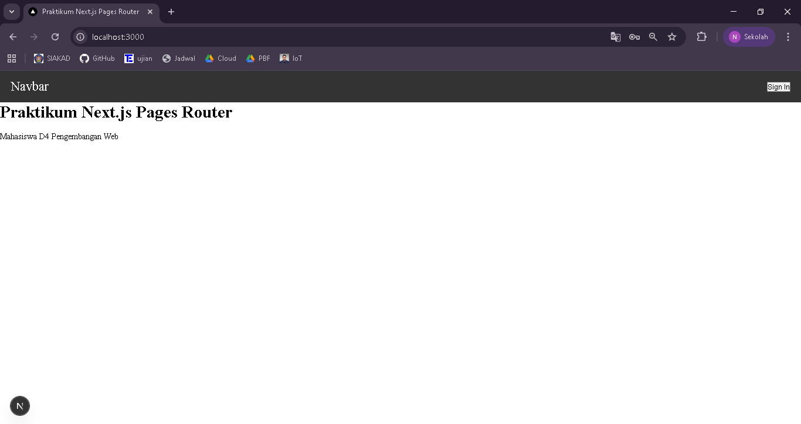

2. Hasil ketika button sign in di klik dan diisi data
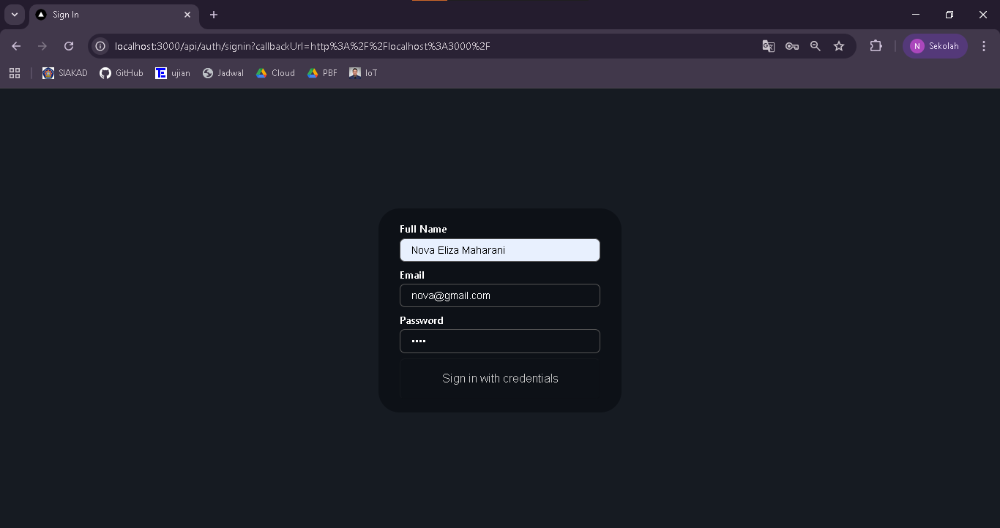

3. Klik sign in maka akan berhasil login dan muncul session
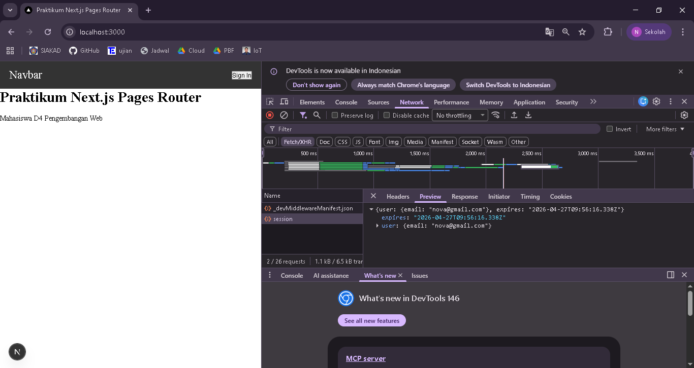

4. Hasil menjalankan setelah penambahan untuk kode menangkap data session
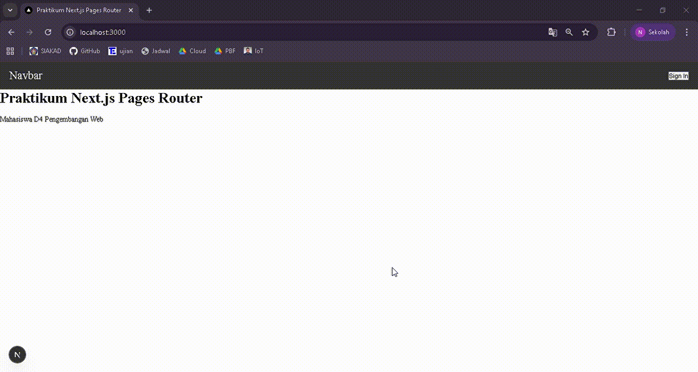

## D. Menambahkan Data Tambahan (Full Name)


## E. Proteksi Halaman Profile
- Tampilan halaman profile
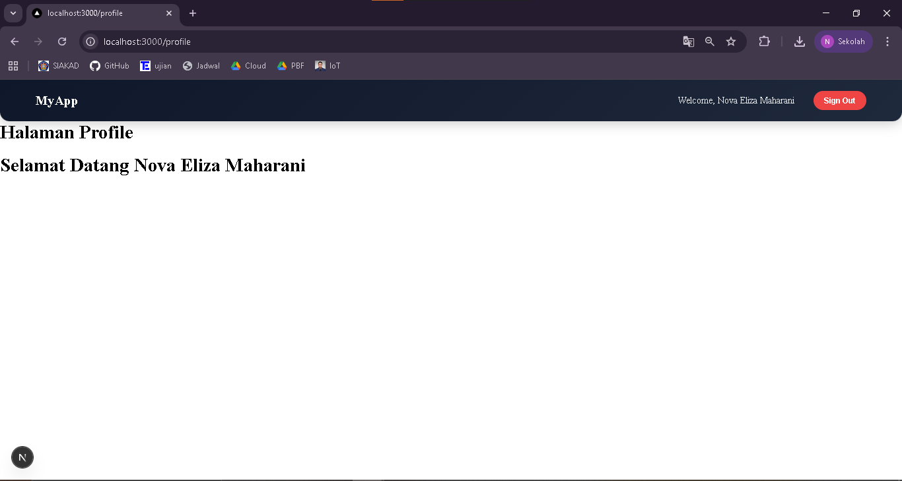
- Hasil setelah menambahkan middleware authorization
Jika belum melakukan sign in maka tidak akan bisa mengakses halaman profile


## F. Pengujian

### Uji 1 - Belum Login
- Hasil redirect ke home
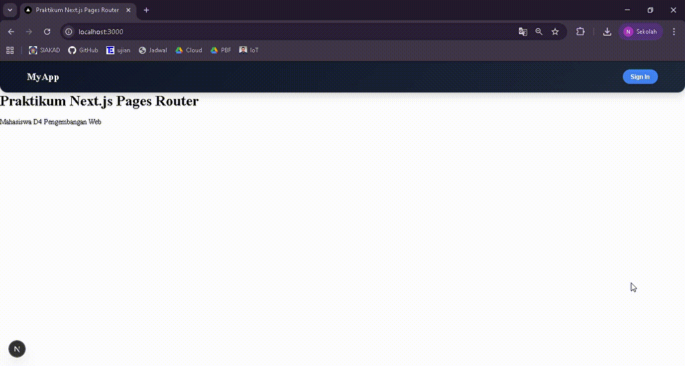

### Uji 2 - Sudah Login
- Hasil bisa akses profile


### Uji 3 - Logout
- Hasil redirect ke home
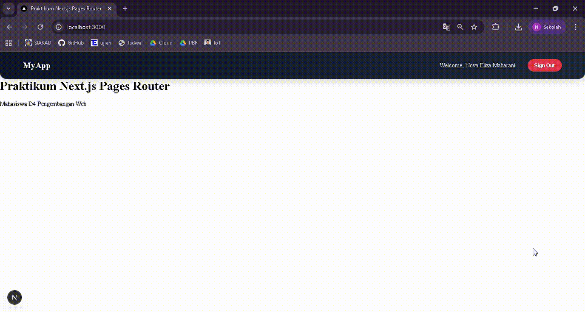

## G. Alur Login NextAuth

```
User klik Sign In
↓
NextAuth menampilkan form credentials (email & password)
↓
Fungsi authorize() dijalankan
↓
JWT (JSON Web Token) dibuat
↓
Session disimpan oleh NextAuth
↓
Frontend mengakses session dengan useSession()
```

## H. Tugas Praktikum

1. Hasil tampilan login


2. Hasil tampilan session
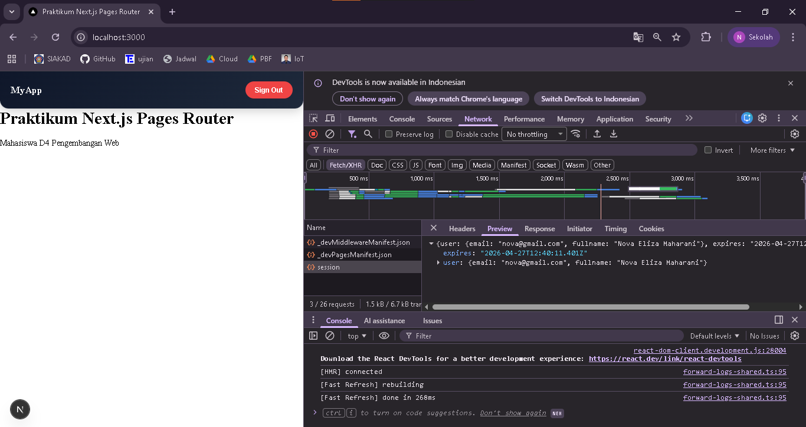

3. Hasil redirect middleware


## I. Pertanyaan Analisis

1. Mengapa session menggunakan JWT?
- Jawab : Karena JWT tidak perlu disimpan di server. Data user sudah ada di dalam token, jadi lebih cepat dan praktis

2. Apa perbedaan authorize() dan callback jwt()?
- Jawab : 
  - authorize() : untuk cek login (email & password benar atau tidak)
  - jwt() : untuk menyimpan data user ke dalam token

3. Mengapa middleware perlu getToken()?
- Jawab : Karena middleware tidak bisa pakai useSession(), jadi harus pakai getToken() untuk cek user sudah login atau belum

4. Apa risiko jika NEXTAUTH_SECRET tidak digunakan?
- Jawab : Token jadi tidak aman dan bisa disalahgunakan, serta bisa menyebabkan error pada login.

5. Apa perbedaan autentikasi dan otorisasi dalam sistem ini? 
- Jawab : 
  - Autentikasi : cek siapa user (login)
  - Otorisasi : cek hak akses user (boleh masuk atau tidak)