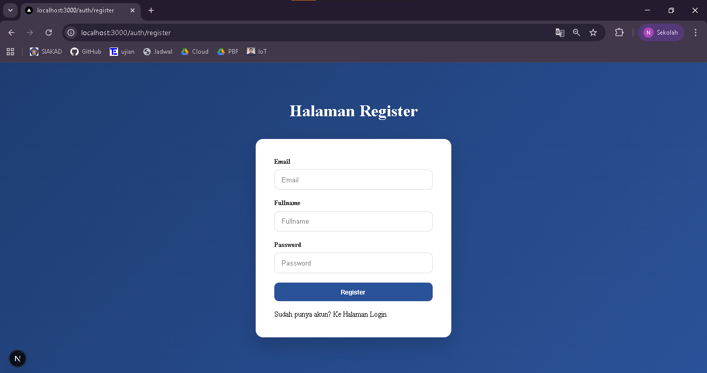
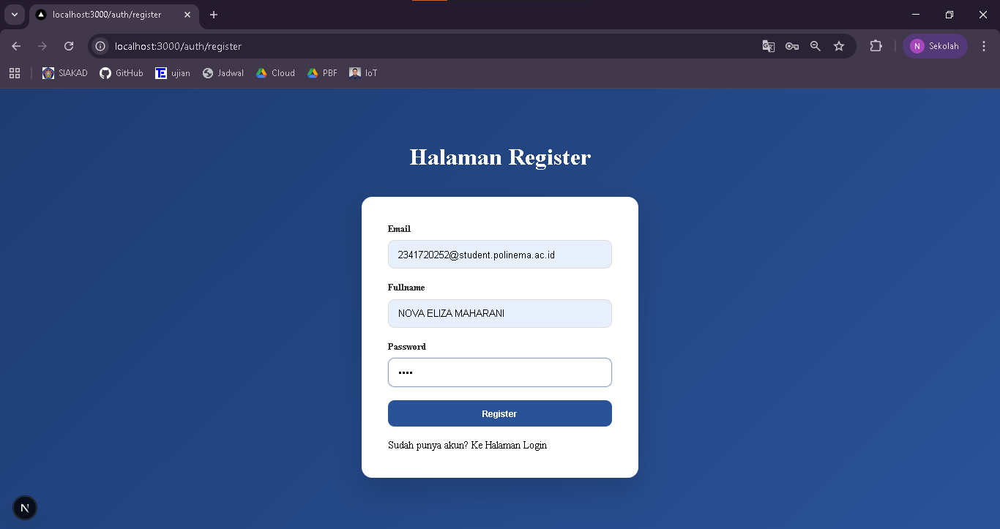
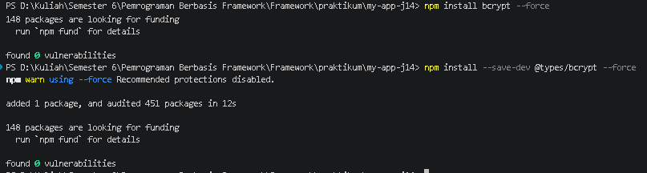
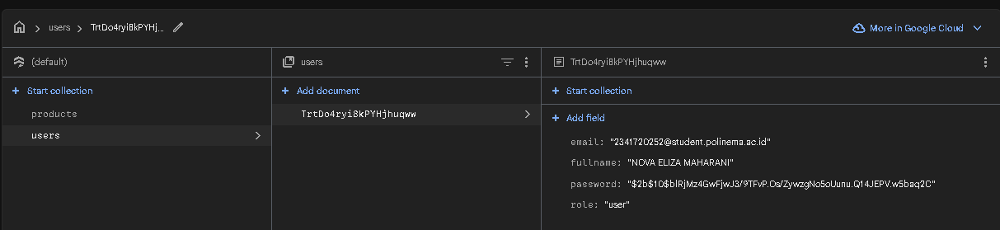
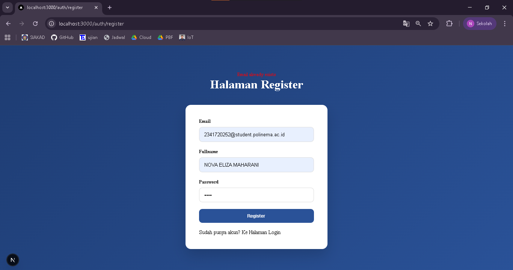
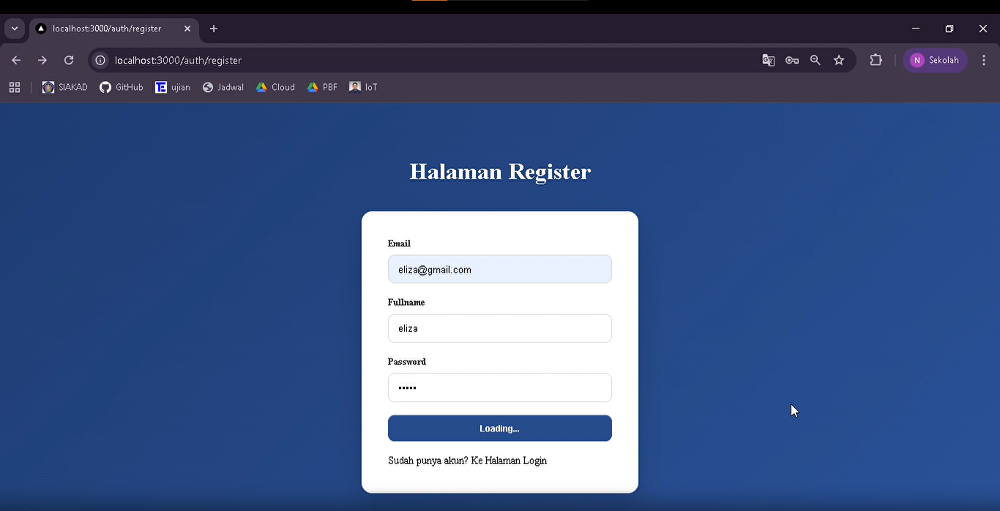
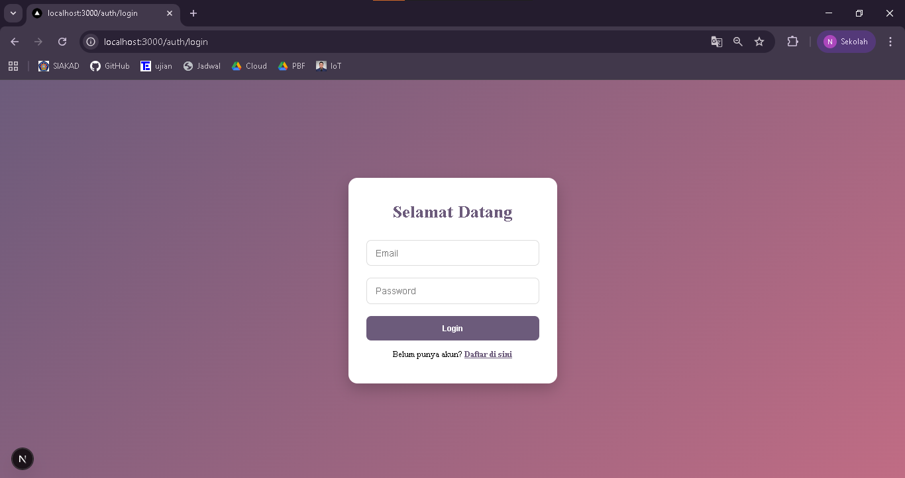
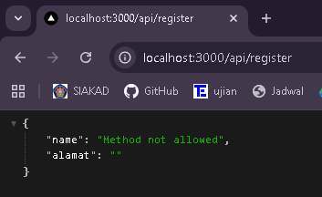
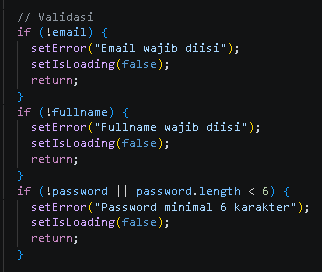
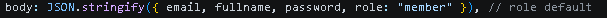

## 
LAPORAN PRAKTIKUM JOBSHEET 14

## 
IMPLEMENTASI SISTEM REGISTRASI (DATABASE INTEGRATION)

  

  

  

## 
Oleh :

## 
Nova Eliza Maharani

## 
NIM. 2341720252 

  

## 
PROGRAM STUDI D-IV TEKNIK INFORMATIKA

## 
JURUSAN TEKNOLOGI INFORMASI

## 
POLITEKNIK NEGERI MALANG

## 
MARET 2026

  

## C. Langkah Praktikum

### Langkah 1 – Membuat Register View

### Langkah 2 - Membuat API Register

### Langkah 3 - Install bcrypt

- Melakukan install ``npm install bcrypt --force`` dan ``npm install --save-dev @types/bcrypt –force``

- Data register berhasil masuk pada firebase

- Hasil perbaikan apabila user memasukkan data yang sudah terdaftar

- Menambahkan loading pada button

## D. Pengujian

### Uji 1 - Register Baru
- Input email baru

- Hasil tersimpan di firestore dan password ter hash

- Redirect ke login (masih tampilan yang lama)

### Uji 2 - Email Sudah Ada
- Muncul message "email already exists"

### Uji 3 - Method GET
- Muncul message "Method Not Allowed"

## E. Struktur Database (Firestore)

### Struktur Data User

| Field     | Tipe               |
|-----------|--------------------|
| fullName  | string             |
| email     | string             |
| password  | string (hashed)    |
| role      | string             |
| createdAt | timestamp          |

## G. Tugas Praktikum
1. Implementasikan register terhubung database.

2. Tambahkan validasi:
o Email wajib
o Password minimal 6 karakter

3. Tambahkan role default "member".

4. Tampilkan pesan error di UI.

5. Screenshot hasil:
o Register sukses

o Email sudah ada

o Database Firestore

## H. Pertanyaan Analisis

1. Mengapa password harus di-hash?

Jawab : Password harus di-hash agar tidak disimpan dalam bentuk teks asli. Jika database bocor, password pengguna tetap aman karena hash sulit dikembalikan ke bentuk asli. Hashing juga mencegah penyalahgunaan akun.

2. Apa perbedaan addDoc dan setDoc?

Jawab :
- addDoc: Menambahkan dokumen baru secara otomatis dengan ID yang di-generate Firestore
- setDoc: Menyimpan atau menimpa dokumen dengan ID yang ditentukan

3. Mengapa perlu validasi method POST?

Jawab : Validasi method POST memastikan endpoint hanya bisa menerima request pembuatan data, sehingga GET atau request lain tidak bisa menimpa atau mengubah data secara tidak sengaja

4. Apa risiko jika email tidak dicek unik?

Jawab : Jika email tidak dicek unik, pengguna bisa mendaftar lebih dari satu akun dengan email yang sama, yang bisa menyebabkan kesulitan login, kebingungan data user, risiko keamanan dan duplikasi data di database

5. Apa fungsi role pada user?

Jawab : Role menentukan hak akses pengguna di sistem, misalnya:
- admin : bisa mengelola data dan user lain
- member/user : hanya bisa melihat atau mengubah data sendiri