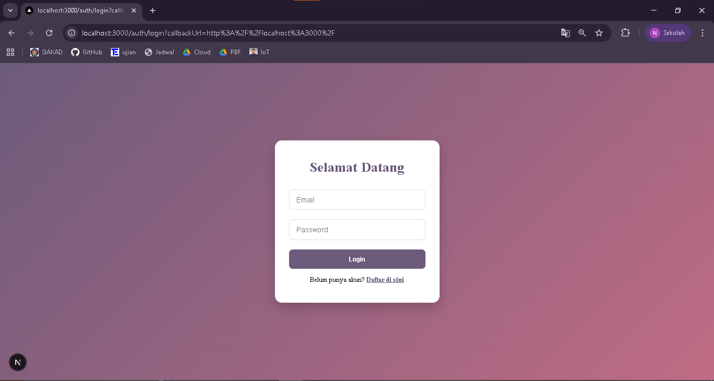
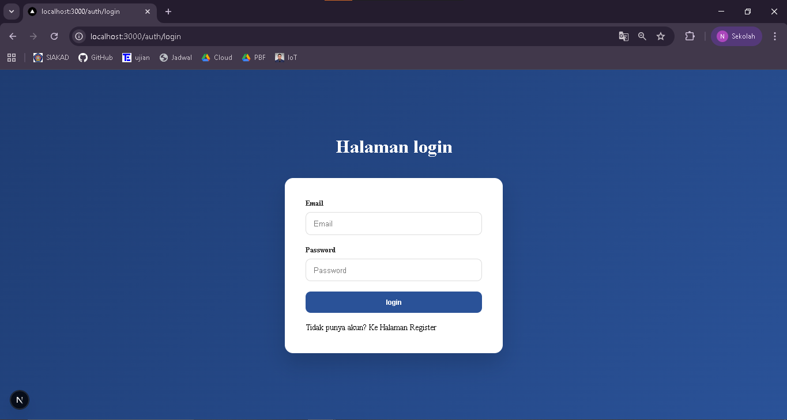
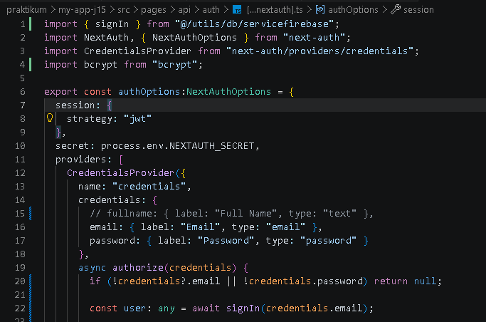
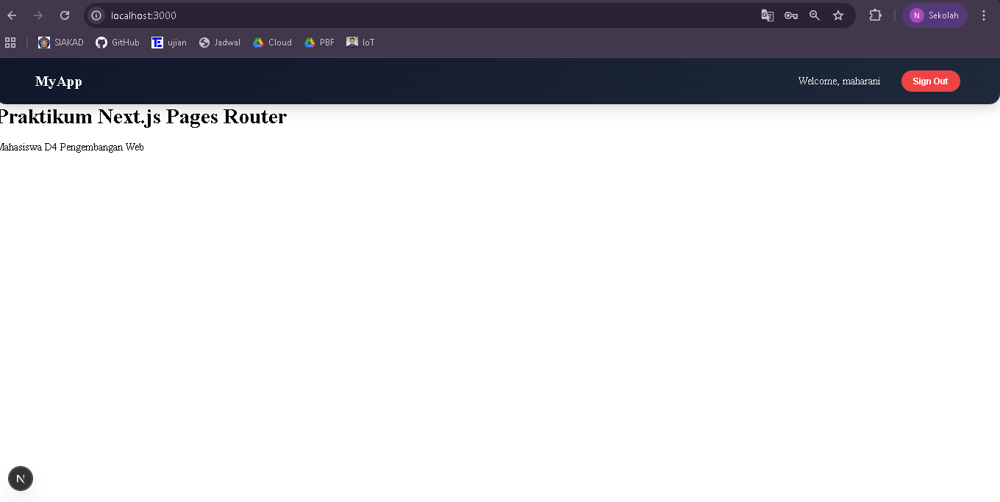
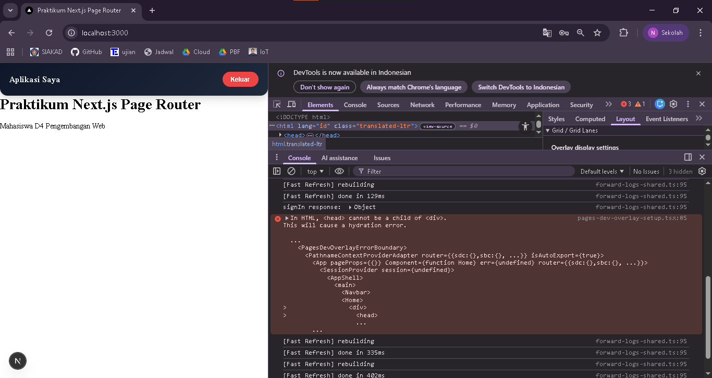
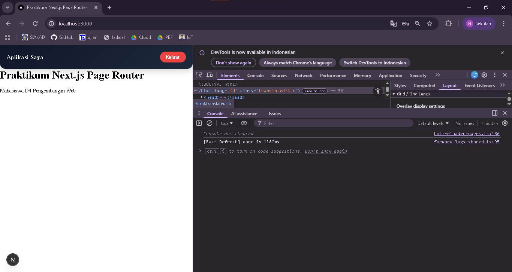

## 
LAPORAN PRAKTIKUM JOBSHEET 15

## 
IMPLEMENTASI LOGIN DATABASE & MULTI-ROLE

  

  

  

## 
Oleh :

## 
Nova Eliza Maharani

## 
NIM. 2341720252 

  

## 
PROGRAM STUDI D-IV TEKNIK INFORMATIKA

## 
JURUSAN TEKNOLOGI INFORMASI

## 
POLITEKNIK NEGERI MALANG

## 
APRIL 2026

  

## C. Langkah Praktikum

### Langkah 1 – Custom Login Page
Ketika tombol sign in di klik maka akan langsung diarahkan ke halaman login

### Langkah 2 - Handle Login di Frontend
Tampilan login sudah sesuai dengan halaman registrasi

### Langkah 3 – Authorize di NextAuth (Database Login)

### Langkah 4 – Tambahkan Role ke Token
- Hasil login akun

- Terdapat error

- Hasil setelah perbaikan

