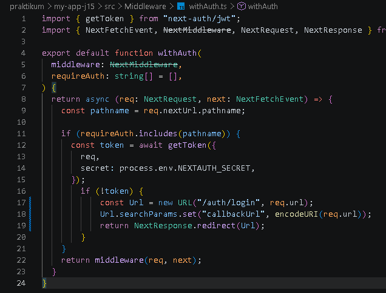
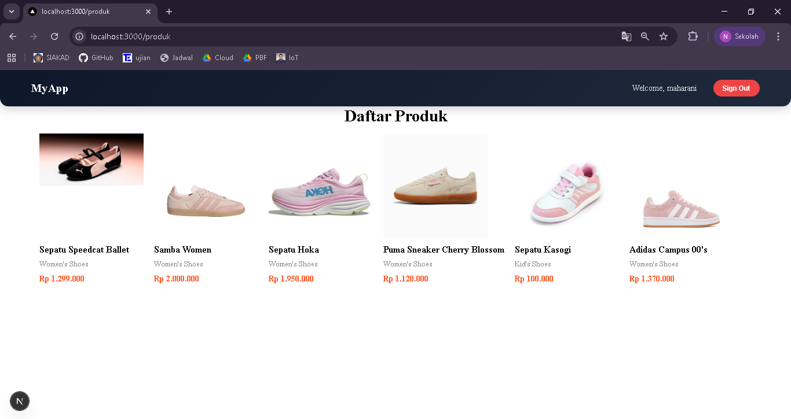
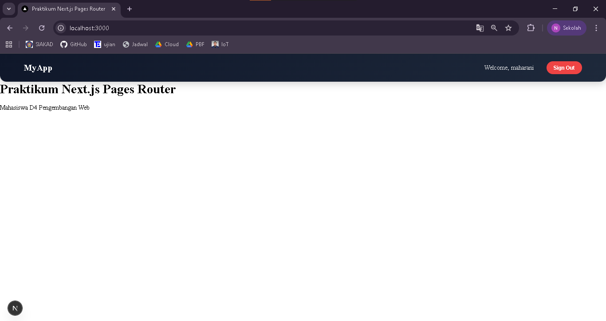
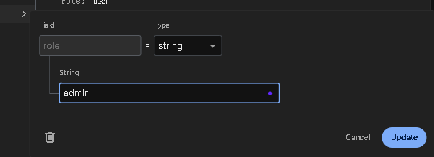
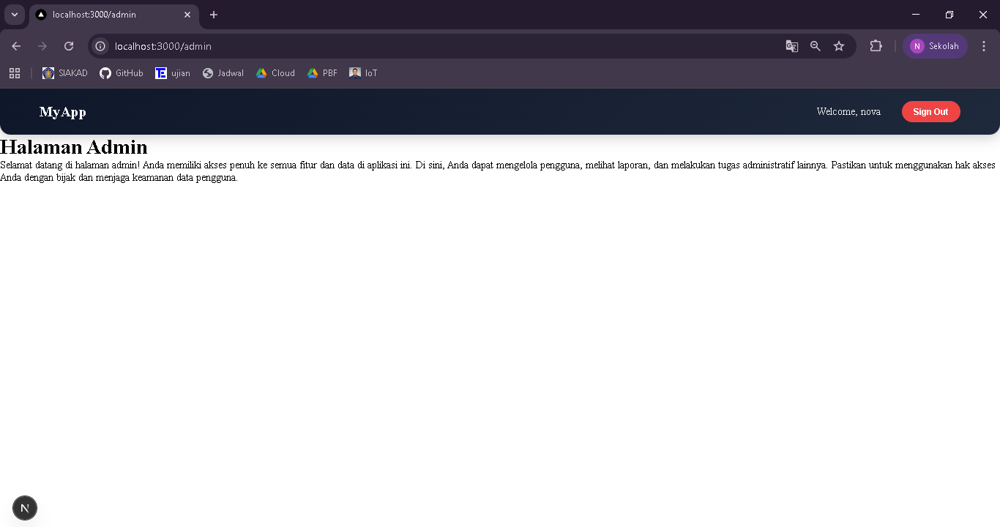
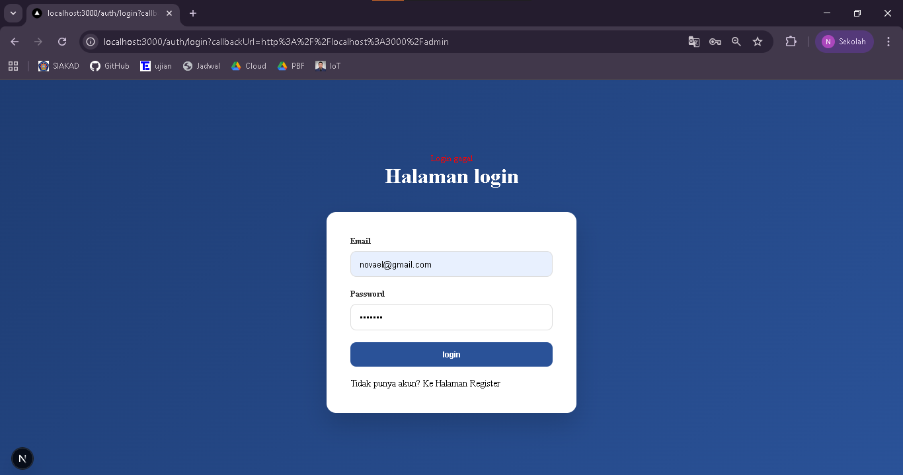
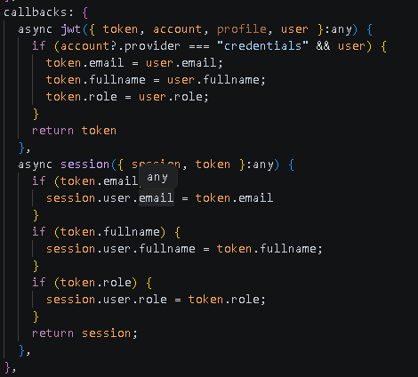
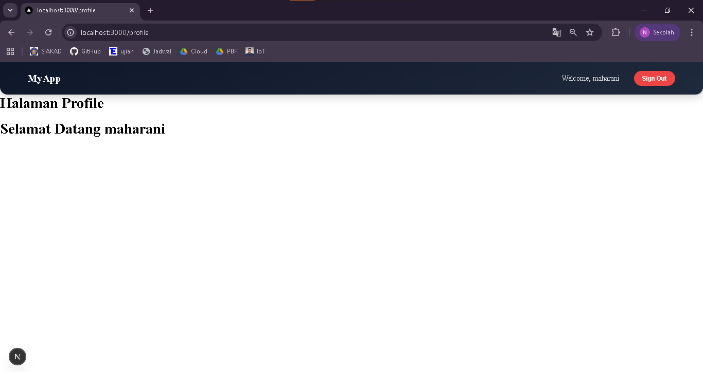
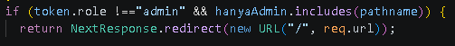

## 
LAPORAN PRAKTIKUM JOBSHEET 15

## 
IMPLEMENTASI LOGIN DATABASE & MULTI-ROLE

  

  

  

## 
Oleh :

## 
Nova Eliza Maharani

## 
NIM. 2341720252 

  

## 
PROGRAM STUDI D-IV TEKNIK INFORMATIKA

## 
JURUSAN TEKNOLOGI INFORMASI

## 
POLITEKNIK NEGERI MALANG

## 
APRIL 2026

  

## C. Langkah Praktikum

### Langkah 1 – Custom Login Page
Ketika tombol sign in di klik maka akan langsung diarahkan ke halaman login

### Langkah 2 - Handle Login di Frontend
Tampilan login sudah sesuai dengan halaman registrasi

### Langkah 3 – Authorize di NextAuth (Database Login)

### Langkah 4 – Tambahkan Role ke Token
- Hasil login akun

- Terdapat error

- Hasil setelah perbaikan

### Langkah 5 - Callback URL Logic

### Langkah 6 – Membuat halaman Admin dan authoriz
- Hasil membuka halaman produk pada role user

- Hasil membuka halaman admin pada role user (kembali ke home)

- Mengubah role di firebase

- Hasil membuka halaman admin dengan role admin

## D. Pengujian

### Uji 1 – Login Valid
Input:
• Email benar
• Password benar
Hasil:
• Login berhasil
• Redirect sesuai callbackUrl

### Uji 2 – Password Salah
Input:
• Email benar
• Password salah
Hasil:
• Error message tampil
• Tidak login

### Uji 3 – Akses Admin sebagai User
Login sebagai:
• role: user
Akses:
/admin
Hasil:
• Redirect ke home

### Uji 4 – Akses Admin sebagai Admin
Login sebagai:
• role: admin
Akses:
/admin
Hasil:
• Bisa masuk halaman admin

## E. Struktur Database Users

Collection: users
-------------------------------|
| Field     |  Tipe            |
-------------------------------|
| email     |  string          |
| password  |  string (hashed) |
| role      |  string          |
| fullName  |  string          |
--------------------------------

## F. Perbandingan Sistem

| Fitur      | Sebelum    | Sekarang        |
|------------|------------|-----------------|
| Login      | Hardcoded  | Database        |
| Password   | Plaintext  | Hashed          |
| Role       | Tidak ada  | Ada             |
| Redirect   | Manual     | Callback URL    |
| Middleware | Basic      | Role-based      |

## G. Tugas Praktikum

1. Implementasikan login database.

2. Tambahkan role pada user.

3. Buat halaman:
- /profile

- /admin

4. Proteksi /admin hanya untuk admin.

5. Implementasikan callback URL
