## 
LAPORAN PRAKTIKUM JOBSHEET 16

## 
IMPLEMENTASI LOGIN GOOGLE PROVIDER DENGAN NEXTAUTH.JS + FIREBASE

  

  

  

## 
Oleh :

## 
Nova Eliza Maharani

## 
NIM. 2341720252 

  

## 
PROGRAM STUDI D-IV TEKNIK INFORMATIKA

## 
JURUSAN TEKNOLOGI INFORMASI

## 
POLITEKNIK NEGERI MALANG

## 
APRIL 2026

  

## B. Konfigurasi Google OAuth

### Langkah 1 – Masuk ke Google Cloud Console

### Langkah 2 – Buat Project Baru

### Langkah 3 – Konfigurasi OAuth Consent Screen
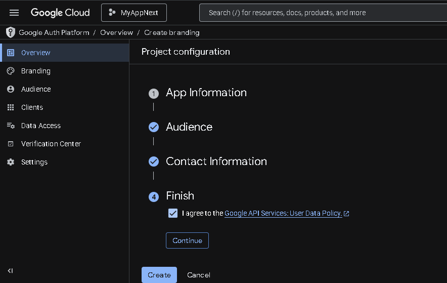

### Langkah 4 – Buat OAuth Credentials
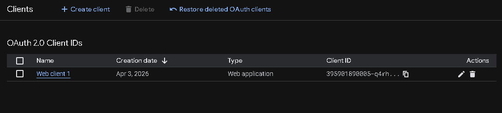

## C. Tambahkan Environment Variables 
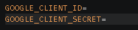

## D. Konfigurasi Google Provider di NextAuth dan Handle Callback JWT & Session
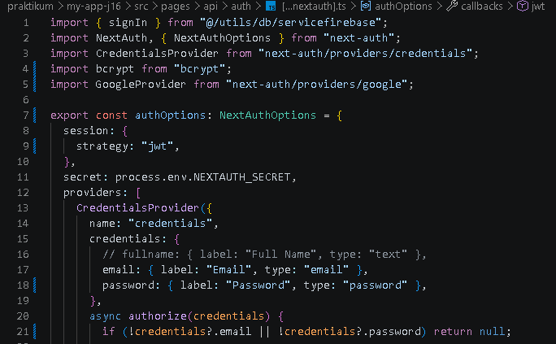

## E. Tambahkan Button Login Google 
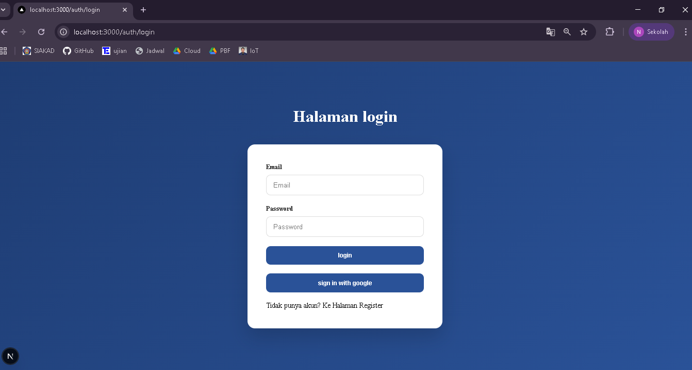
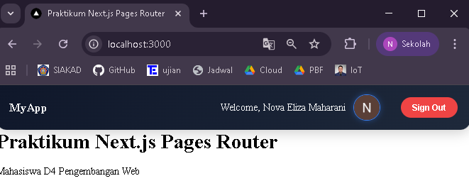

## G. Simpan Data Google ke Database 
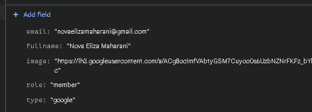

## H. Pengujian

- **Login Google pertama kali** → Data tersimpan di Firestore  

- **Login Google kedua kali** → Data diupdate  
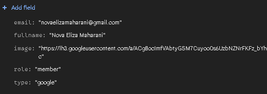

- **User role member akses /admin** → Redirect  
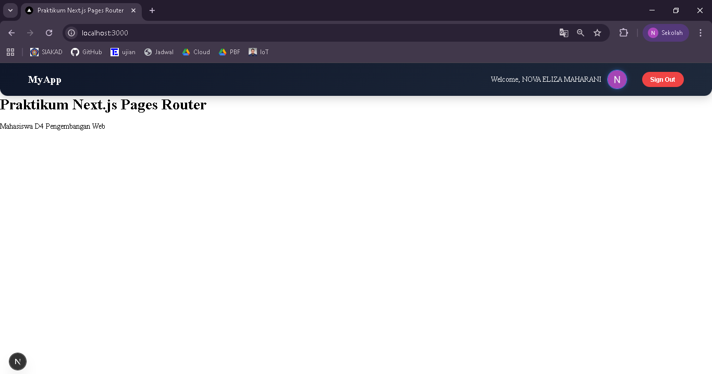

- **User role admin akses /admin** → Bisa masuk
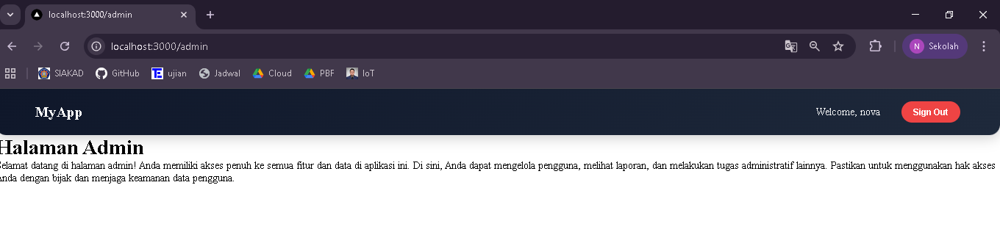

- **Avatar tampil** → Ya

## I. Analisis & Diskusi

1. Apa perbedaan login credential dan login Google?
Jawab :
- Login credential: user memasukkan email & password sendiri, diverifikasi melalui database.
- Login Google: user masuk menggunakan akun Google, verifikasi dilakukan oleh Google, password tidak diperlukan di aplikasi.

2. Mengapa data Google tetap perlu disimpan ke database?
Jawab : Agar aplikasi punya kontrol penuh atas user, bisa menyimpan role, preferensi, atau data tambahan, dan memudahkan manajemen user di sistem sendiri.

3. Apa fungsi JWT callback?
Jawab : JWT callback digunakan untuk menambahkan atau memodifikasi informasi dalam token sebelum disimpan, seperti email, role, fullname, atau avatar.

4. Mengapa perlu multi-role?
Jawab : Multi-role memungkinkan aplikasi mengatur hak akses berbeda untuk user, misalnya admin bisa akses halaman admin, user biasa hanya halaman publik.

5. Apa risiko jika tidak menyimpan user ke database?
Jawab : Tidak bisa menyimpan role atau data tambahan, kontrol akses terbatas dan bisa menimbulkan kesulitan manajemen user.

## J. Tugas Mandiri

1. Tambahkan role editor
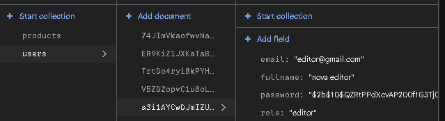

2. Buat halaman khusus editor
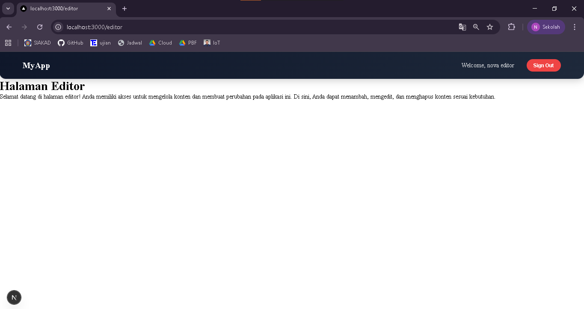

3. Tambahkan provider GitHub
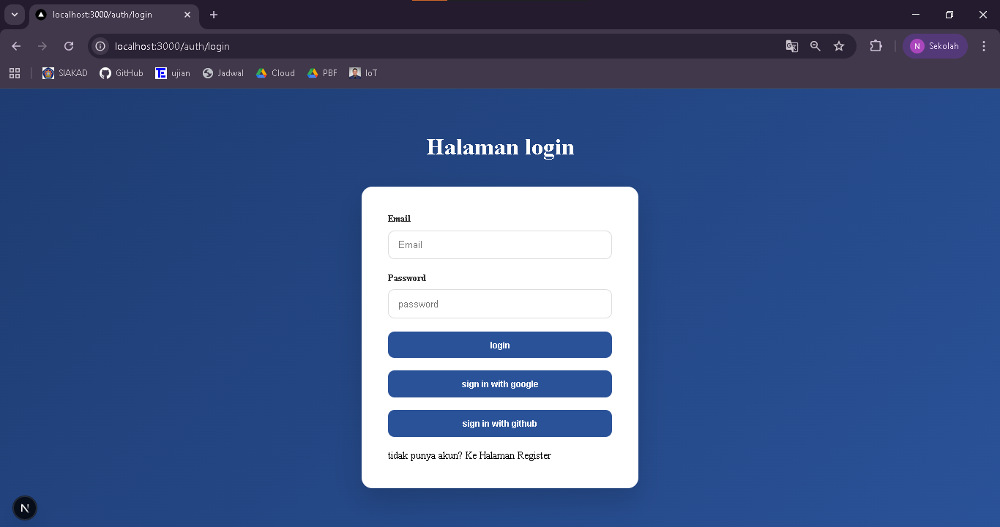
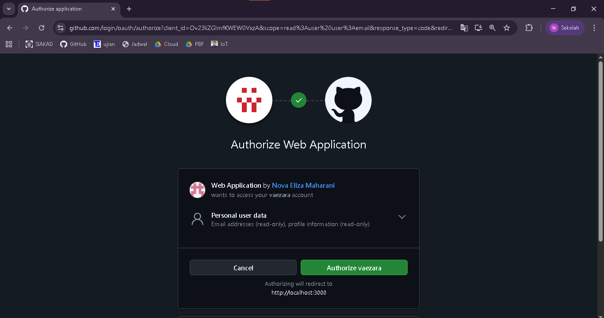
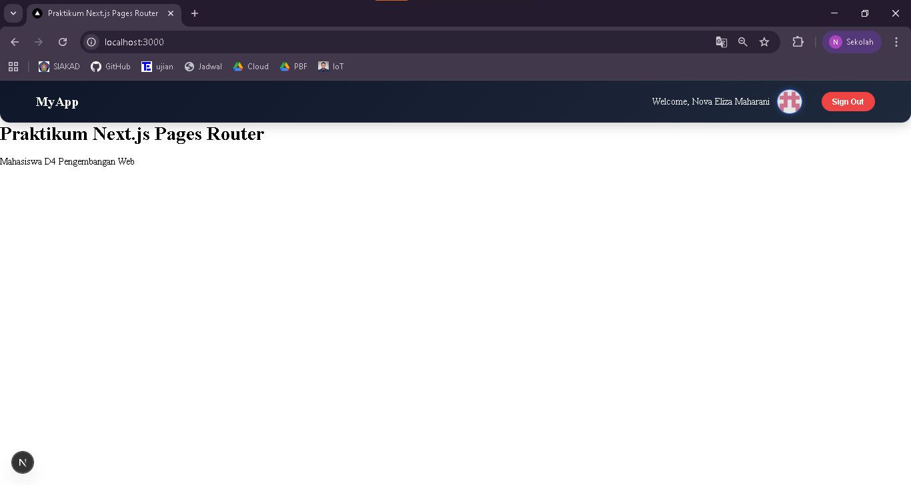

4. Refactor service agar reusable
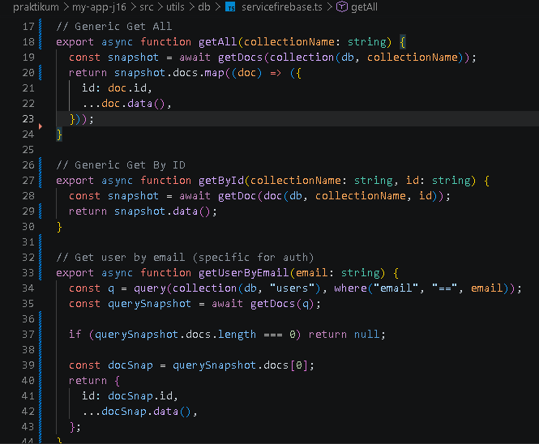
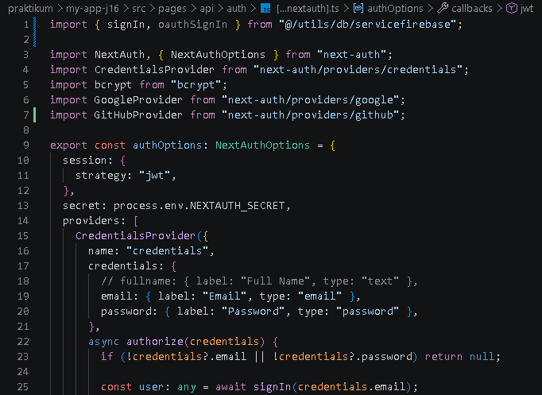

5. Gunakan next/image untuk optimasi avatar
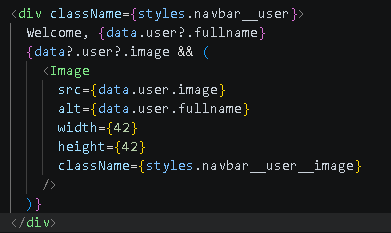