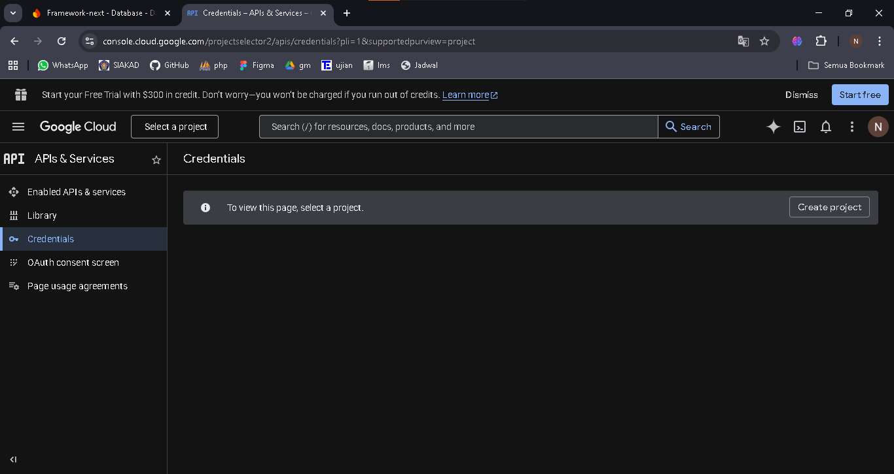
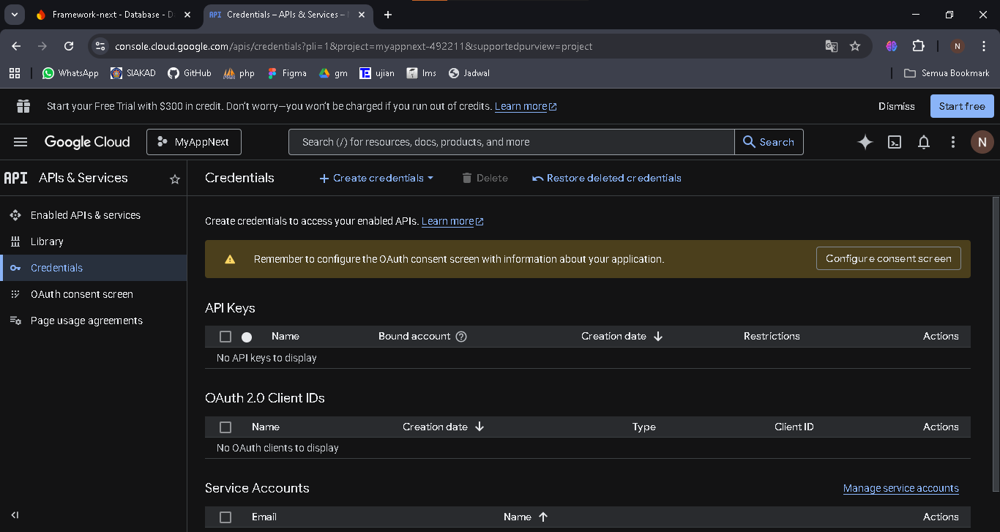

## 
LAPORAN PRAKTIKUM JOBSHEET 16

## 
IMPLEMENTASI LOGIN GOOGLE PROVIDER DENGAN NEXTAUTH.JS + FIREBASE

  

  

  

## 
Oleh :

## 
Nova Eliza Maharani

## 
NIM. 2341720252 

  

## 
PROGRAM STUDI D-IV TEKNIK INFORMATIKA

## 
JURUSAN TEKNOLOGI INFORMASI

## 
POLITEKNIK NEGERI MALANG

## 
APRIL 2026

  

## B. Konfigurasi Google OAuth

### Langkah 1 – Masuk ke Google Cloud Console

### Langkah 2 – Buat Project Baru
