## 
LAPORAN PRAKTIKUM JOBSHEET 18

## 
UNIT TESTING

  

  

  

## 
Oleh :

## 
Nova Eliza Maharani

## 
NIM. 2341720252 

  

## 
PROGRAM STUDI D-IV TEKNIK INFORMATIKA

## 
JURUSAN TEKNOLOGI INFORMASI

## 
POLITEKNIK NEGERI MALANG

## 
APRIL 2026

  

## Praktikum 1 – Setup Jest di Next.js

### Langkah 1 – Install Dependencies
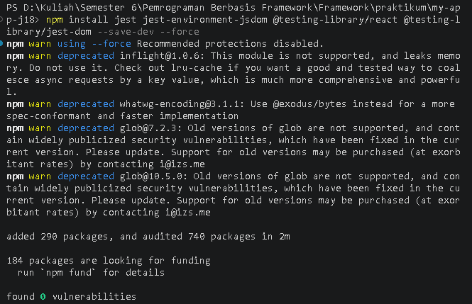

### Langkah 2 - Buat File Konfigurasi
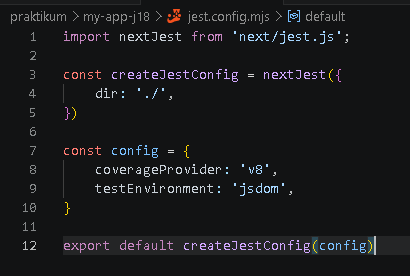

### Langkah 3 - Tambahkan script di package.json
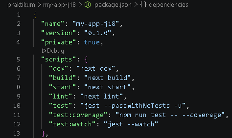

## Praktikum 2 – Struktur Folder Testing
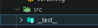

## Praktikum 3 – Testing Halaman About

### Langkah 1 - Buat File Testing
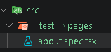

### Langkah 2 - Contoh Testing Snapshot. Pada about.spec.tsx tambahkan code berikut :
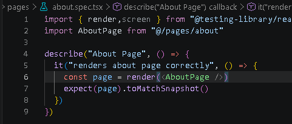

### Langkah 3 - Jalankan Testing
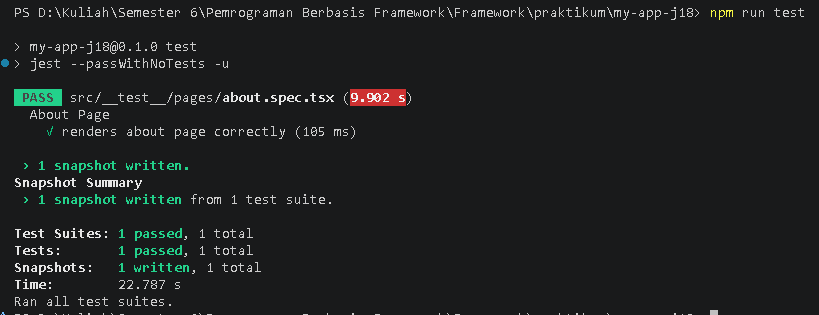

## Praktikum 4 - Coverage Report

- Menjalankan ``npm run test:coverage``
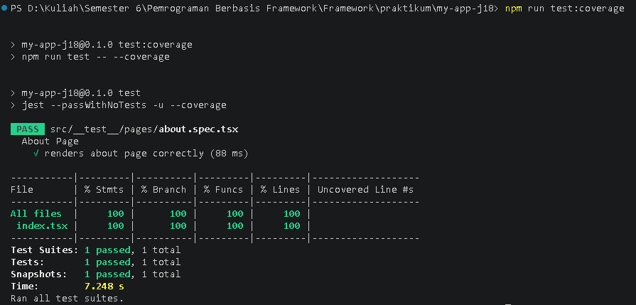

- Folder /coverage
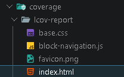

- Hasil
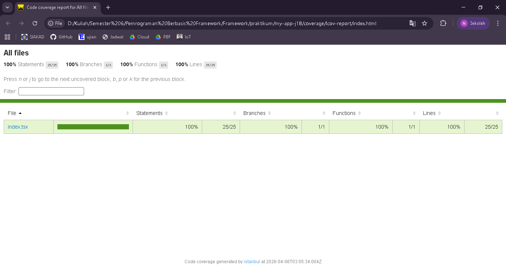

## Praktikum 5 - Konfigurasi Coverage Lengkap

- update ``jest.config.mjs``
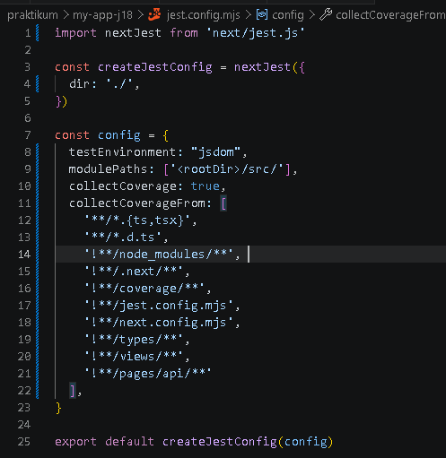

- Menjalankan ``npm run test:coverage``
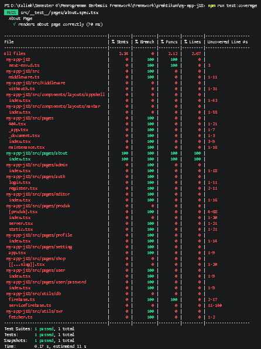

- Hasil dari ``index.html``
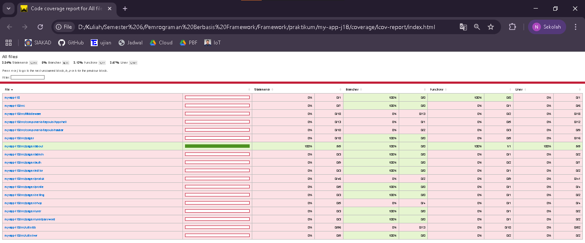